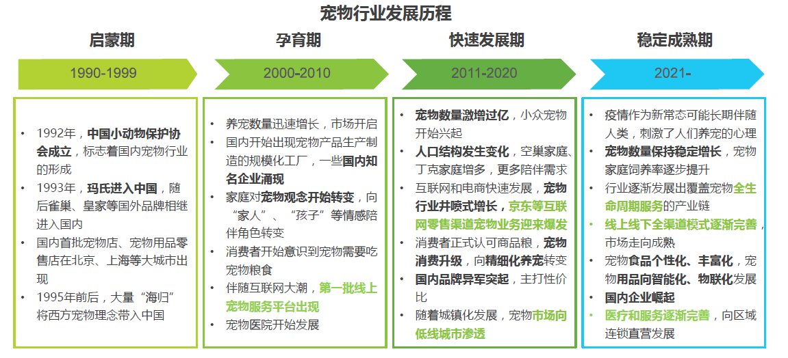
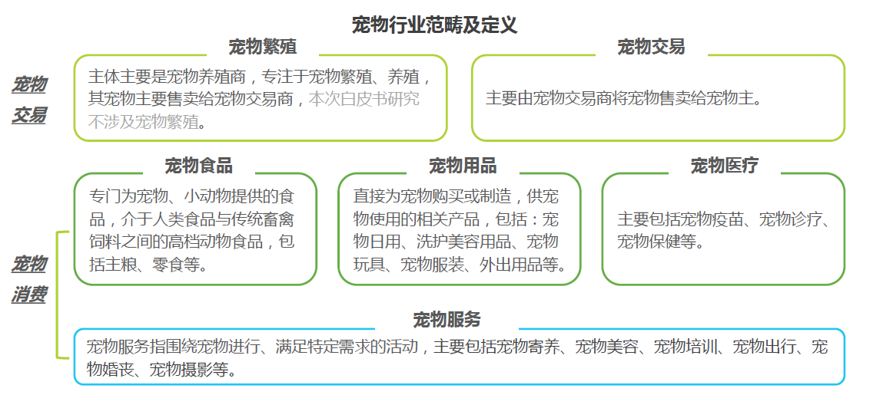
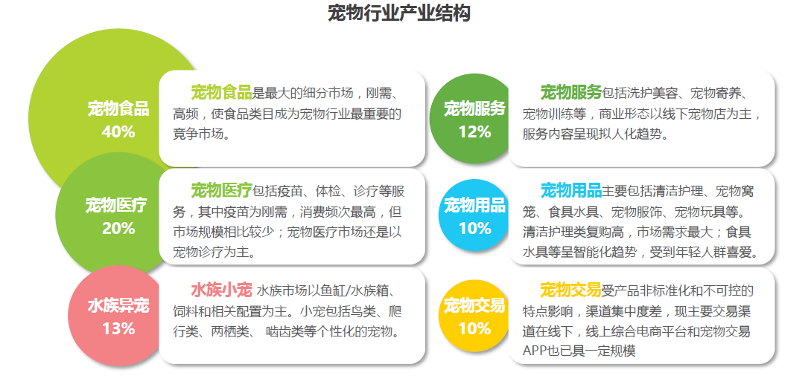
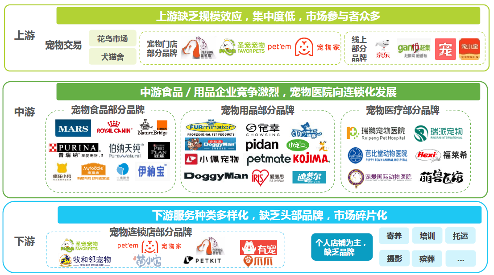
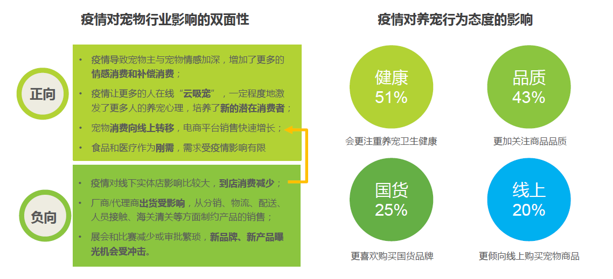

### 1 场景

#### 1.1 宠物爱好者

场景IP：**想宠就“宠”，不再“云吸宠”；说出你的养宠趣事**。

场景分发：“云吸宠”（看宠物小视频时）对养宠物的心动，通过有保障的养宠攻略以及快捷有保障获得宠物的方式，让心动者行动。同时，捕获养宠人社交心态，放大分享动机推进分享养宠趣事。

- 了解并评估：晓琳在搜索养猫攻略时，发现了这个平台。但是一开始她以为这只是一个宠物用品商城，就草草地略过了。晓琳在“云吸猫”时发现了一个优质的宠物博主在PetLover平台上也有分享，就对平台进行了一番细致了探索。晓琳发现了平台其他宠物爱好者详细地养宠经历与趣味小视频，更有养宠经验与忠告，加之有知名宠物博主的入驻，晓琳对PetLover平台上的养宠经验可靠性充满了信心。
- 购买并传递获得：晓琳购买心仪品种的小猫是在PetLover的宠物交易模块进行，她通过了模块何附近的宠物店进行了线上联系与咨询，但是并没有找到。在浏览附近其他地区的宠物商店时，发现了宠物竟然可以快递邮寄，而且有专门的保障服务。这让晓琳欣喜狂，同时根据攻略在宠物用品模块购买了相应的宠物用品。当小猫健康平安地送达，蜷缩在笼子里时，晓琳悬着的心也放了下来。
- 交互：当遇到宠物问题时，晓琳继续查看PetLover上的养宠攻略，获取进一步的建议；悠闲时刻，晓琳也会看看其他人的养宠趣闻，惹得晓琳忍俊不禁；晓琳也会刷刷宠物商城，看看有没有想要的给小猫添置的宠物用品，宠物食品。
- 售后：晓琳很担心宠物的邮寄问题，但是平台的快递承诺——保证宠物安全送达，不然由平台承担费用损失，让晓琳稍微放心了下来。晓琳对某件宠物用品在不太满意，平台允许7天无理由退换的要求满足了晓琳这样的有充分购买欲望但是不知道商品用处是否很大的宠物爱好者。
- 评价与复购：晓琳对平台很满意，能够在平台满足自己全方位的养宠需求。晓琳认为平台值得继续使用。

#### 1.2 宠物医疗行业从事者

场景IP：**你值得更大的舞台**。

场景分发：对于N线小城市的从事宠物医疗服务人员，由于地理原因处于小城市，无法充分发挥自己的专业知识，创造更多的价值。宠物在线咨询给他们提供了更大的平台发挥自己的专业知识价值。

- 了解并评估：阿添在所在的宠物医院和PetLover平台合作是了解到这个平台。入驻后，发现这个平台的客流量很高，同时可以通过空闲时间回答问题给出专业建议而获得一定地兼职收入，这让阿添的目标——给更多地宠物看病从而获得更高地收入，得以实现。
- 购买并传递获得：阿添入驻PetLover咨询医师，在每回答一个问题之后，都会得到平台的收入补贴。
- 交互：PetLover平台会推荐问题给每个入驻咨询医师。阿添可以从中选择自己擅长的问题来回答。在每次回答完后，都会有相应的评价回复提示，这让阿添能够得到及时的反馈。
- 售后：阿添在某次回答了问题却没有收到平台提供的补贴，这让阿添有点愤怒。阿添发现平台提供了申诉模块，赶忙去申诉。平台在5分钟左右就回复了阿添的申诉，很快就把补贴发送到了阿添的账户上，并且给了阿添额外的补贴作为赔偿，这让阿添心里的火气降了下来。
- 评价与复购：阿添对平台庞大的流量以及能够通过发挥自己的专业知识来得到额外的报酬十分满意，在空闲时间会持续使用平台。

#### 1.3 宠物及用品供应商

场景IP：**解决电商“最后一公里“问题；线下店铺线上宣传**。

场景分发：对于有志于拓展线上业务的宠物用品店，需要额外的人力来专注于快递的发送，无疑增加了开线上店铺的成本。平台通过解决快递这样的”最后一公里“问题，让店铺专注产品质量；线下店铺可以通过线上宣传增加知名度。

- 了解并评估：小川的一个养宠朋友给他推荐了PetLover平台。小川得知平台上面入驻了不少宠物用品商店，但是他们所在城市并没有宠物用品店的线下网点，于是果断联系PetLover平台入驻。
- 购买并传递获得：小川所经营的宠物用品商店成为了当地第一家PetLover的线下网点，同时在平台的帮助下解决了没有额外人力参与邮寄商品的问题，平台会负责商品的邮寄，小川只需要把商品打包即可，因此小川的网店也在平台上重新开始经营。由于平台的流量，小川的线下商店知名度也越来越高，吸引很多当地的PetLover用户来购买。
- 交互：平台在每个订单到来时，小川会收到提示按照约定的时间将商品列表打好包，让平台来负责邮寄。同时用户对于商店评价也会及时给小川反馈。
- 售后：无（可以按照意愿，随时退出平台）
- 评价与复购：在平台流量的加持，以及平台快递支撑下，小川的店铺越做越好，小川对于入驻平台十分满意，希望能够在平台上面越做越大。

#### 1.4 动物保护志愿者

场景IP：**你的行动应该被看见**。

场景分发：对于有志于保护小动物的动物保护志愿者，苦于传统宣传手段的局限性，受众对象和传播广度受限，没有办法充分宣传保护流浪动物的精神，让更多愿意加入保护流浪动物的有志者。利用流量优势让动物保护志愿者的行动与声音被更多地宠物爱好者知道，让动物保护志愿者的理想得到满足。

- 了解并评估：淑元了解到中国小动物保护协会与PetLover进行了合作，获得了中国小动物保护协会的授权。中国小动物保护协会的认可给予了淑元信心，淑元随即就注册了一个账号，希望能够让自己的理念被更多人了解并传播。
- 购买并传递获得：淑元以志愿者的身份，发布了一些关于当地小动物保护的推文，很快就获得了许多宠物爱好者和宠物店主，咨询医师等人的关注。当地的宠物医院与流浪猫救助协会联系上了淑元，邀请她一同参与正在进行的小动物救助的项目。这让淑元十分开心。
- 交互：当淑元的推文发出去之后，都会获得一系列回复的提示，都是对淑元的鼓励。这让淑元更加充满动力。
- 售后：无
- 评价与复购：淑元觉得平台是自己宣传保护小动物精神的广阔窗口，在这里进行宣传比起自己一个人面对面的宣传，有着受众面更加有效与传播面更加广泛的优势。淑元认为自己会把自己的行动放在平台上，持续利用线上线下结合的方式，更好地宣传保护小动物的精神。

### 2 市场潜力评估

#### 宠物行业背景概述

我国宠物行业从野蛮生长期进入了有序增长的稳定成熟期。我国宠物行业从20 世纪 90 年代初的花鸟市场年代，伴随着宠物消费产品和服务的日益丰富、人口结构的变化、宠物角色和养宠理念的转变、以及移动互联网技术对宠物行业交易模式和服务模式的改变，经过 30 年的发展，我国宠物行业经历了启蒙期、孕育期、快速发展期，目前进入了有序增长的稳定成熟期。

宠物行业包括宠物交易和围绕宠物消费的商品和服务。宠物行业是指一切围绕着“宠物”而产生的产业链，涉及到宠物的繁殖与宠物交易，以及围绕宠物消费的商品和服务，包括宠物食品、宠物用品、宠物医疗和宠物服务。目前，我国宠物行业逐渐发展出覆盖宠物衣食住行、生老病死的全产业链。

宠物行业产业结构以宠物食品是消费的核心，医疗、用品及各类型服务日渐增长。宠物食品类目是宠物行业最大的细分市场，随着人们对喂养商品粮的认知提升，市场对宠物食品的需求将进一步释放；其次是宠物医疗，主要为依托宠物医院和个体诊所的诊疗服务；宠物用品的细分品类较多，其中智能设备的成交量快速增长；宠物服务的形式日渐丰富，随着居民消费升级和养宠理念、宠物角色的转变，宠物服务行业将稳步增长。

宠物行业产业链逐步完善，上下游集中度低，中游竞争相对激烈。

随着我国居民收入提升和养宠人群不断扩大，宠物消费相关的商品和服务类型不断丰富，国内宠物行业规模快速扩张。2020 年我国城镇宠物市场规模接近三千亿元， 2015-2020 年6年间复合増速达到 32.8% 。随着宠物家庭渗透率和行业成熟度的持续提升，宠物行业依然会保持稳步增长。

国家规范性文件和养宠相关政策条例的陆续推出，推动宠物行业的规范化发展。随着居民收入的提升，居民消费观念升级，重视对生活品质及对情感消费的投入将推进宠物行业消费向多样化发展。人口结构的变化，空巢老人和空巢青年人群的增加，越来越多的人将陪伴的渴望寄托于宠物。同时，新媒体技术的进步，短视频等社交媒体的爆发，驱动了“云吸宠”的发展，为宠物行业带来更多的市场规模和潜在消费者。受疫情影响，对宠物陪伴时间增加驱动整体宠物消费增长，宠物主对宠物健康关注度提升。同时，疫情加速了在线“云吸宠”人群的扩张，为行业培养了更多新的潜在消费者。同时在疫情的影响下，线下实体店客流减少，但消费者的升级趋势和消费意愿还在，更多的消费者转移到线上，电商平台销售快速增长。

reference：艾瑞咨询2021年中国宠物消费趋势白皮书

#### 宠物食品市场

当前，我国宠物食品行业仍处于较为分散的状态，国际品牌占据主要地位。华创证券资料显示，2017年中国宠物食品品牌份额（按零售价值）分布中，国际品牌占据超过30%的市场份额。不能忽视的是当前国产宠物食品品牌的出现与发展，CBNDATA资料显示，2016年至2018年国产宠物粮食品牌销售额增速较快。至2020年，天猫双十一宠物品牌销售金额排行榜中，国产品牌占据5席。作为宠物市场最重要的细分市场，我国宠物食品市场处于高速发展的阶段，近几年平均增速保持在20%左右。同时，基于我国供应链体系优势，新兴国产宠物食品品牌具备新生与成长的底层基础，但仍需品牌方夯实研发环节，注重满足宠物主对于宠物食品绿色、健康等需求的回应。

宠物食品市场产业链包括：食品研发-食品生产-食品销售等环节。其中上游食品研发环节以国内代工厂以及品牌自营研发基地为主；中游以宠物食品生产厂商为主；下游主要以宠物食品分销渠道为主，当前主要销售渠道包括商超、电商平台、便利店等。

PetLover平台参与宠物食品销售环节，要加强对中游的宠物食品生产厂商的密切合作关系，同时根据消费者对国产或者紧扣品牌的青睐程度作出市场调研，引进国内外的优质宠物食品产品，满足消费者的需求。

#### 宠物医疗市场

在宠物医疗消费市场大型连锁宠物医疗集团已经出现，但医疗服务仍以个人宠物诊所为主。宠物医疗消费市场主要指代围绕宠物医疗需求的服务市场，通常包括疫苗接种、绝育、体检、门诊治疗、手术等服务。

当前市场中可以为宠物提供诊疗服务的线下机构包括宠物医院、个体宠物诊所、第三方检测机构、宠物店等。其中宠物医院是所有机构中专业性较强、诊疗手段较为先进的机构，通常可以为宠物提供门诊和手术、美容等多种医疗服务；个体宠物诊所是当前市场中数量最多的机构，主要以个人经营者为主。部分经营者持有兽医执照或会聘请具有兽医执照的兽医师参与经营活动，这类机构通常能够为宠物提供门诊、检测以及简单手术和美容、寄养等服务，相较于宠物医院的专业性，其综合性较弱，同时诊疗能力又高于普通宠物店；当前部分宠物店也会提供宠物诊疗服务，这种服务通常仅针对简单的病症；此外，宠物医疗市场中还有一类第三方检测机构也能够提供宠物诊疗服务，不过这种服务通常围绕动物样本检测展开。目前中国宠物医疗市场中以宠物医院、宠物诊所为主体，其中个体注册的宠物诊所是数量最多的机构。

PetLover平台提供专属的医疗服务希望能覆盖更加广泛的客户群体，因此平台不只需要为专业的宠物医院提供一个在线服务平台。个体宠物诊所作为一个广泛分布的，有空间局限性的，相对于宠物医院来说微小的可以整合的资源，PetLover能够为个体宠物诊所提供在线服务的窗口，让个体宠物诊所能够摆脱物理空间局限性，创造平台连接宠物爱好者与宠物医疗从业人员，最大化发挥优质资源的价值。

#### 宠物服务市场

宠物服务市场一般指代面向宠物主和宠物，提供满足日常生活和休闲娱乐的服务市场。本章将针对除宠物医疗服务以外的其他服务展开。当前宠物服务市场主要分为美业服务、殡葬服务、生活服务、休闲娱乐、其他服务等。其中，美业服务包括宠物美容、宠物洗浴等；殡葬服务包括宠物火化、安葬等服务；生活服务包括宠物培训、宠物寄养、宠物出行等；休闲娱乐包括宠物摄影、宠物主题活动等。

痛点：行业准入门槛低；从业者专业技能不足。目前，宠物服务市场进入门槛较低，宠物店大多是单体运营状态，连锁服务品牌较少；同时，单体宠物店部分服务人员技能培训不足，服务能力有待提升。与之对应的是，宠物主对服务提供商的忠诚度不高。

发展：连锁宠物服务品牌商的出现促进服务质量提升。随着宠物市场的发展，宠物主对宠物服务需求增加，宠物服务市场已经出现包括萌它宠物、宠物家等连锁宠物服务店铺。这类连锁门店较为重视管理，对服务系统有需求。同时它们对于专业服务有更高的要求，会给对从业人员进行不同程度的培训。

不足：宠物服务市场仍处于待深度挖掘的状态。

与医疗市场相同，PetLover作为一个平台连接连接宠物爱好者与宠物服务从业人员，希望能覆盖更加广泛的客户群体。为了解决目前宠物服务市场的痛点，PetLover平台有必要对进入平台的单体宠物店或连锁服务品牌进行从业人员资质审核，以保证提供优质服务。

#### 总结

随着我国宠物行业进入稳定期，宠物产业链不断完善，线上线下全渠道模式成熟，人们对于饲养宠物的需求不断增加，促使宠物行业市场标准化，专业化。但是目前宠物医疗市场、宠物服务市场等细分领域还存在着不足。PetLover瞄准当前定制化，一体式服务等高端服务需求，提供平台连接高质量服务者和客户。通过在线咨询、在线预约线下服务等方式，整合市场资源，节约客户成本，提升细分市场产品质量。同时通过用户创造内容的方式构建社区，每个细分客户分享优质内容，优质资源得以被发掘，既满足了宠物爱好者“云吸宠”的需求，又能够使用宠物爱好者的对资源进行评估。

### 3 新闻、调研及相关分析

#### 3.1 为什么宠物可以成为一个长尾投资趋势？

- 画布元素：核心活动，价值主张，客户关系
- 链接：https://www.morganstanley.com/ideas/us-pets-investing-trend
- 内容概要：疫情后的美国的宠物产业现状分析以及未来宠物产业细分市场
- 分析：疫情已经颠覆了人类的生活，但对于宠物来说，却是一笔财富：它们的主人一整天都在家里，时时刻刻都在关系和照顾它们。2021年的一项调查发现，66% 的美国家庭至少拥有一只宠物，平均 1.7 只。大部分的受访者“强烈同意”他们的宠物是家庭的重要成员，约三分之一的人会借债来支付宠物的医疗费用，约30% 的人会把宠物的需要放在自己的前面。同时，宠物主人——尤其是年轻的主人——在他们的宠物上花费越来越多。通过这样的事实证明，即使在经济处于衰退期间，从兽医护理到宠物配件的所有支出都具有弹性的，人们愿意为宠物支出。除了宠物的“衣食住行”，越来越多的人会关注宠物的健康。在宠物食品和零食之后，动物健康是最大的细分市场，而宠物护理可能是宠物行业未来十年增长最快的细分市场。PetLover平台提供包括宠物食品购买、宠物医疗服务等的一站式服务，涵盖了当下与未来宠物行业的热门细分市场，立足于当下的增长点，发展未来宠物医疗的可能性。

#### 3.2 中国宠物行业的异军突起背后的问题

- 画布元素：重要合作
- 链接：https://pandaily.com/the-extraordinary-rise-of-chinas-pet-industry/
- 内容概要：宠物行业的进入门槛低以及宠物行业的相关政策法规的法律空白导致宠物行业出现许多问题。
- 分析：根据中国社交网站[狗民网](Goumin.com)和[亚洲宠物博览会](http://www.petfairasia.com/)联合发布的《2020中国宠物行业白皮书》，2020年城市居民饲养的猫狗数量达到10084万只。中国城市常住人口接近8.5亿，这意味着十分之一的人拥有一只宠物猫或狗。宠宠的热潮，促使许多垂涎宠物经济带来的丰厚利益的投资者，急切地进入这个行业，争先恐后地在蓬勃发展的市场中分一杯羹。近年来，宠物美容、宠物寄养、宠物运输等宠物相关服务如雨后春笋般涌现。大量投机者涌入宠物行业，其中大部分没有接受过专业培训，宠物服务质量参差不齐。填补宠物行业的相关政策法规的法律空白来使得宠物行业标准化的到来可能还有很远一段路要走，PetLover平台通过对重要的合作者，例如宠物医院，线下宠物店，快递业等的资格认证和服务质量要求，提供高于法规的标准，信誉有保证，专业周到的宠物产品和服务，有效地缓解宠物行业相关法律法规不完善的问题，保证服务质量。

#### 3.3 《2020年中国宠物行业白皮书》发布，宠物行业迎来“千宠千面”新食代

- 画布元素：客户细分，价值主张
- 链接：http://www.forbeschina.com/business/55094
- 内容概要：《2020年中国宠物行业白皮书》发布，揭示中国的宠物行业新的发展趋势
- 分析：据《2020年中国宠物行业白皮书》显示，2010年以后，国内宠物行业进入快速发展期。伴随着国内养宠方式的转变和宠物角色朝着伴侣方向的变化，宠物的家庭属性和地位逐渐稳定。大部分的宠物主人将宠物视作自己的孩子或家人。人均收入提高、消费升级以及养宠观念发生转变，宠物与人的感情黏性增强等因素驱动，宠物服务行业逐渐兴起，宠物市场空间迅速扩大。同时，我国宠物行业上升空间巨大。我国的宠物饲养率与发达国家相差较大，未来宠物数量仍然有很大的上升空间；宠物消费不断升级，单只宠物消费额逐年上升。电商经济推动宠物食品行业爆发式增长，各种品牌的宠物食品百花齐放，逐渐进入“千宠千面”的定制化阶段，开启了“新食代”。PetLover平台主张定制化，为我们的主要客户细分——宠物爱好者，提供更加定制化专门的宠物建议，从饮食到医疗再到宠物产品，从多方面进行定制化。

#### 3.4 高盛表示中国的宠物护理支出将大幅增加

- 画布元素：收入来源，价值主张，客户关系
- 链接：https://www.ft.com/content/d9b76550-bd18-4f1a-acf1-68fb6616cd65
- 内容概要：高盛表示中国宠物市场将持续扩大，随着每只宠物支出的不断扩大，宠物行业收入将不断上升。
- 分析：高盛投资银行在一份 104 页的报告中阐述了中国宠物护理市场的案例。该报告预测，从现在到 2030 年，宠物食品支出的年复合增长率将达到 19%，因为除其他因素外，中国有近2亿只猫和狗从吃剩菜转向吃包装宠物食品。至关重要的是，该报告预测未来十年中国宠物市场将发生转变，因为该行业正在扩张以满足快速增长的单身和老年人口的需求。高盛说，这两个人口群体与每只宠物的支出都比世界其他地方更高。PetLover平台构建宠物社区，利用用户创造内容（UGC），为单身以及老年人为代表的宠物爱好者提供更加优质的宠物饲养体验，能够在自己饲养宠物的同时，接收其他宠物爱好者的分享信息，沟通饲养心得，结识同道“宠友”。PetLover留住高价值客户，创建潜在的消费场景，从而在不断扩增的宠物行业中获取客观收入。