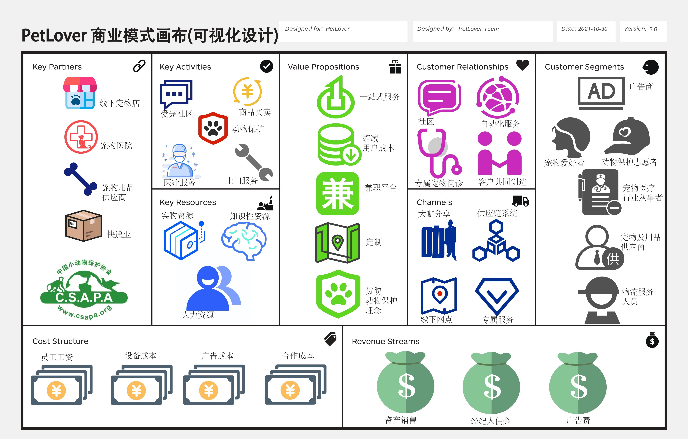

## 待完成任务

- 客户洞察部分
  - 针对3-5个客户群体进行分析说明，包含客户针对产品的看、听、想与感受、说与做、痛点、收益六个部分。
  - 对每个客户群体画出相应的移情图，模板如pdf
- 搜索并分析3-5篇新闻报道或调研报告，并完成相关分析
- 补充视觉化思考中的相关分析

## 2.1 客户洞察

### 2.1.1 宠物爱好者

- **看：**

  有很多对宠物情有独钟的客户，他们或自己拥有爱宠，或因为自身条件无法饲养宠物。他们往往会在各大新媒体平台浏览关于各类宠物的短视频或动态，满足心理上对萌宠的强烈需求，做到“云吸宠”，也会同身边的人（如邻居、朋友等）交流宠物饲养的经验、碎碎念等等，在爱宠需要食物、洗刷用品、药品时他们会在电商平台上购买相关物品，在爱宠得病或需要接种疫苗时他们又会到当地宠物医院咨询并寻求相关医疗服务。而这类用户为了满足这几项需求会遇到这样几个问题：需要跨多个平台寻求服务，效率较低；大多数社交平台宠物爱好者密度较小，没有形成爱宠社区，很难与其他用户产生共鸣；获取宠物饲养经验的途径较少。

- **听：**

  朋友和邻居会将宠物饲养技巧或自己爱宠的萌点讲给他们听；新媒体博主的各种吐槽和爱宠日常行为分享；养宠费用高昂会打磨他们饲养宠物的兴趣；他们了解网络社区概念，宠物主题的网络社区可以集中具有共同兴趣的访问者，但让他们头疼的是大多宠物社区的信息不可信且充斥着广告信息。

- **想与感受：**

  对于计划养宠的客户，他们希望能有一个线上平台能够全方位的了解各种宠物的特征信息并能更加划算、可靠的购买宠物；对于拥有宠物的客户，他们深受虚假信息、广告信息的困扰，希望向别人请教养宠技巧、快速获得优质信息，同时也希望分享自己爱宠的动态获得他人的肯定和情感上的共鸣，他们也思考如何才能低成本的饲养宠物、到哪里去买便宜且可靠的宠物用品、如何方便快捷的为爱宠寻求医疗服务；对于不养宠的客户，他们喜欢萌宠而希望做到云养宠。

- **说与做：**

  吐槽养宠感受；分享养宠日常；购买宠物及其用品；咨询宠物医疗服务；通过现有社交平台结识宠物爱好者来分享或获得养宠经验。

- **痛点：**

  跨平台寻求服务，不方便；虚假信息和网络信息过多，影响判断；身边养宠爱宠人士较少，很难同身边的人获得情感上的共鸣，分享宠物日常途径较少，分享得到的反馈较少；宠物用品昂贵且购买途径较少、质量难以得到保证；由于大多宠物医院都是线下服务，寻求宠物医疗服务需要耗费大量时间。

- **收益：**

  相对较低价格的宠物及其用品，降低养宠成本；使用集社区论坛、医疗服务、宠物及其用品购买、物流服务、售后服务、质量保障于一体的平台，分享能得到反馈，购买质量得到保证，养宠更加便利；线上医疗咨询，上门医疗服务，减少爱宠求医浪费的时间。

### 2.1.2 宠物医疗行业从事者

- **看：**

  这类用户有专职也有兼职。在线下环境中，专职宠物医疗从事者大多通过在宠物医疗机构工作，周围是同事、宠物患者及其主人，他们习惯于同宠物主人打交道并跟他们沟通宠物身体状况，为宠物提供人道主义的医救方式，和同事交流宠物治疗经验。而很多地区宠物医疗机构覆盖率低，具体见“听”部分，宠物医疗从事者会错过很多未覆盖地区的宠物医疗服务，收入较低，兼职者参与宠物医疗工作不方便。

- **听：**

  中国宠物医疗行业整体运行处于低水平状态，宠物医生人才储备不足，宠物医疗行业从事者就业机会比较多，但另一方面，宠物医院等医宠物疗机构大多分布在一二线城市，分布密度城市中心>社区>街道，对小城市的宠物医疗行业从事者不利；互联网+迅速发展，宠物医疗行业商业模式正在向互联网+靠拢；目前线上医疗咨询成为一个趋势。

- **想与感受：**

  他们希望能够增加服务机会，提高收入；希望能在线上提供医疗咨询获得收入，兼职宠物医疗从事者希望有一种线上接单的方式来增加兼职工作的便利性，以此实现自身宠物医疗能力的价值并获取收益；宠物医院经营者希望增加客流量，扩大经营规模。

- **说与做：**

  与宠物主人互相吐槽养宠的麻烦以及交流如何才能减少养宠麻烦，为宠物主人提供医疗服务便利，实现共赢；提供线上咨询服务；通过互联网、电话、邮件等媒介提供宠物医疗上门服务。

- **痛点：**

  经营规模小，服务地域范围小，收入较少；兼职宠物医疗从事者在现有网络及现实环境下工作机会少。

- **收益：**

  利用互联网平台扩展业务范围，提供线上宠物医疗咨询服务，扩大潜在服务区域，使得服务不受地域限制，做到上门医疗服务；获得更多订单，赚取更多收入；兼职者能够随时随地利用互联网平台参与宠物医疗服务。

### 2.1.3 宠物及用品供应商

- **看：**

  宠物及用品售卖途径多元化；他们身边有很多相关产品竞争者；常常接触类似视短视频、长视频、微博等新媒体的博主，让他们进行宠物及产品品牌的宣传；通过电商平台售卖。

- **听：**

  电商平台快速发展，冲击了实体商店的售卖；竞争者争相进军电商平台，抢占电子市场；新媒体成为广告投放的主流，宠物及用品供应商投放更多广告以提升销量；物流服务行业发展迅速，该类用户与物流服务行业合作密切。

- **想与感受：**

  希望能针对特定人群投放广告，降低广告成本的同时也能提高销量；希望能有一个平台证明他们产品的可靠性以及广告信息的真实性，以增加买家对他们的信任，且打击假冒伪劣产品，公平竞争；希望降低房租等成本，降低产品价格，提高销量，赚取更多收益。

- **说与做：**

  通过正当渠道获取产品合格证明，并得到平台认可证书；与互联网结合，成为电商；与物流服务业进行合作；降低网购产品价格。

- **痛点：**

  市场上有假冒伪劣产品侵占市场；存在大品牌的不公平竞争；在淘宝、京东等多元化电商平台不能做到面向特定受众，买家分流严重；也正是因为没有面向特定受众，广告投放规模要大，成本高。

- **收益：**

  低成本，低价格，高销量，赚取更多收益；公平竞争。

### 2.1.4 动物保护志愿者

- **看：**

  动物保护志愿者挤出零散时间投入动物保护这项事业中去，他们身边往往是志同道合、愿为动物保护付出的朋友；他们需要通过吸取新媒体工作者的经验来不断调整思想宣传的方式，留意身边人们对待动物的态度，矫正一些人们对待动物的行为，科普动物的爱好、习性等。

- **听：**

  虐待动物、虐待宠物现象仍然存在，例如在高校经常有虐待校园猫的行为；当前周围人们的动物保护意识薄弱；中国小动物保护协会成立并得到进一步发展。

- **想与感受：**

  希望人们加强动物保护意识；希望能有专门的新媒体平台供他们提供思想宣传活动，以传播爱护动物的人道主义思想；思考以何种方式能够高效率推进动物保护、思想传播这两项工作的进行，如何能够扩大志愿者组织影响力、招收更多志同道合的朋友投入这项事业中。

- **说与做：**

  向人们宣传珍爱生命、倡导精神文明和发扬人道主义精神的思想；开展讲座、宣传平台来进行思想宣传、动物行为及爱好的科普；建立救护收容小动物的基地——爱心教育基地；救护动物；开设热线。

- **痛点：**

  中国小动物保护协会关注度小，很少出现在大众视野中；动物保护志愿者大多是自愿且能力有限；地域广阔，无法做到动物救助和收容、思想宣传及科普工作的大范围覆盖。

- **收益：**

  他们保护动物、维护动物的生存权利和不受虐待的权利的理想是崇高而现实的，作为动物保护志愿者完成他们的使命可以收获心灵上的慰藉；可以让动物保护思想深入大众的内心；相关志愿组织可以走入公众视野，扩大影响力并进一步引领大众保护动物。

## 新闻、调研及相关分析

#### 1、2021宠物医院行业现状如何 未来宠物医院的发展趋势分析

- 画布元素：关键业务、客户细分、渠道通路
- 链接：https://www.chinairn.com/news/20210615/15570027.shtml
- 主要内容：文章分析了国内宠物医疗行业的发展现状以及未来的发展趋势，阐述行业整合将成为宠物医疗企业持续发展的重要手段的事实。
- 分析：中国宠物爱好者是一个庞大的群体，人们对宠物相关服务的需求不断扩大，宠物医疗行业发展必不可少；但是当前中国宠物医疗行业整体运行处于低水平状态，虽然从事这项工作的机构很多，但大多数经济实力不强、技术水平较低、资金分散、规模小、效益低。而且地域差异较大，表现在宠物医疗机构在一二线城市分布密集，在小城市或农村地区分布较少，大多处于中心城区，社区周边和街道较少。宠物医疗行业应当同互联网相结合，使用互联网作为发展平台，进行资源整合，拓展业务范围、扩大网络布局。而PetLover平台为宠物医疗行业从事者提供了这样的平台，同互联网结合，消除地区差异和资源分散带来的行业弊端。

#### 2、社区化的必然趋势

+ 画布元素：关键业务、客户关系
+ 链接：https://zhuanlan.zhihu.com/p/44172796
+ 主要内容：文章分析了科技导致了社区化以及社区化的重要性，不同的社区形式。
+ 分析：社区是指地区性的生活共同体，网络社区是具有相同兴趣爱好的人的虚拟聚集地，是日常或消费进行分享的最主要场地。PetLover建立在社区化的基础上，通过app所提供的虚拟频道，让用户产生互动、情感维系及资讯分享。拥有爱宠的用户可以在社区中分享萌宠长短视频、萌宠图片、动态来赢得其他网友的肯定反馈以及情感上的共鸣；没有宠物但十分喜爱宠物的用户可以在社区同宠物主人互动，浏览宠物动态，获取短暂的心灵上的慰藉；可靠的商家或医疗机构可以在社区发布一些内容真实的广告做宣传；动物保护志愿者可以在社区进行动物保护思想的宣传和动物行为爱好的科普，完成他们的使命。

#### 3、宠物社区是否有成立的可能？

- 画布元素：关键业务、客户关系、渠道通路
- 链接：http://www.woshipm.com/it/3368333.html
- 主要内容：作者在宠物领域创业一年，思考了宠物社区是否有成立的可能，从市场横向进行分析对市场的垂类进行研究，提出了几点个人想法
- 分析：尽管很多类似微博的新媒体平台宠物内容占比较高，但宠物领域一直没有看到一个有影响力的社区出现。目前宠物行业的发展情况有如下几点：养宠人群基数足够大、国内宠物市场发展快但起步晚、国内用户对于养宠的消费升级意识在逐步提高。而且当今养宠群体分为初级型、中级型、进阶型三类，晒宠、购物、科普和养宠讨论都会由这三大群体共同完成，这些活动都需要社区这种土壤来培养，随着宠物社区的成长，养宠或许在未来成为人类生活重要的一部分。因此，宠物社区的出现和发展是一个大趋势，它或是像微博超话一样寄居式生长，或是如我们PetLover项目提供单独社区独立式生长。文章最后提到了宠物消费问题和宠物服务问题（医疗服务、生活科普服务）对于养宠用户的社区来说是绕不开的大山，如何处理好宠物消费、科普和社区的关系是社区搭建中一个比较重要的问题。

#### 4、P出世界的精彩？小红书变“小黑书”，造假终究成不了财富密码！

- 画布元素：价值主张、渠道通路、重要合作
- 链接：https://www.163.com/dy/article/GN2OO3QD0511BMPU.html
- 主要内容：文章主要阐述了小红书商业模式的走偏，分析了小红书的造假行为，对已经被搞乱的小红书来说，当信任被透支，唯一的腿被折断，那就不是道歉能解决的问题了。
- 分析：在当今互联网时代，信息洪流不断冲击这广大网民，信息真实性的辨认成为了让网民头疼的问题，在这种环境下网民选择使用信誉度高的平台而丢弃丧失信誉的平台，互联网时代造假成不了财富密码。对于小红书，曾以“记录真实生活”作为口号，如今却成为造假、失真的“摇篮”，令人唏嘘。当一个种草社区无法种草，信任被透支后，可不是一两句道歉能挽回的事。我们的PetLover作为创业初创项目深刻的思考了这个问题，PetLover在社区方面的商业模式设计与小红书类似，但在价值主张、渠道通路和重要合作中与小红书有所不同，我们要求宠物及其用品供应商供应一定可靠，质量有所保证，且进驻本平台的广告商、电商的经营许可证、产品合格证、经营方式、范围都要经过严格把关，保证平台的信誉，为用户提供一个纯净的平台。

## 可视化思考

考虑到本项目商业模式画布各个要点间联系过多，过多的联系箭头会影响商业模式画布的可视性，因此没在图中展现。

### 相关分析

经过详细的讨论和落实，我们团队创建了一份可视化的商业模式画布（如上），建立了PetLover爱宠平台的大致商业框架。建立了PetLover爱宠平台的大致商业框架。我们的业务核心是爱宠社区的搭建，同时附加平台管理、医疗服务、商品买卖、动物保护等模块的业务。针对这些业务，我们对我们的客户群体进行了划分，其中占比最多的群体是宠物爱好者，他们是爱宠社区内容发布的主力军，其余群体分别为广告商、宠物医疗行业从事者、宠物及其用品供应商、物流服务人员、动物保护志愿者；价值主张以一站式服务（为宠物爱好者提供了宠物日常交流、宠物饲养教程、宠物及其用品购买、宠物健康咨询、宠物医疗服务便利的一站式服务，避免宠物爱好者在其他各个服务平台反复切换）和可靠（社区内容、服务、商品质量可靠）为核心进行拓展，提供兼职平台、缩减用户成本、为不同用户群体进行定制社区、贯彻动物保护理念；客户关系也是以社区为纽带，为各类用户提供社区的自动化服务、专属的宠物问诊等，我们的团队同时与各类用户进行合作，共同创作平台内容，创造一种PetLover专属的社区文化氛围。PetLover以知识性资源为核心，其推广及经营的渠道通路广泛，包括大咖分享、供应链系统、线下网点、专属服务等，为资产销售、广告费用等收入来源提供了渠道，简化了项目的成本结构。

