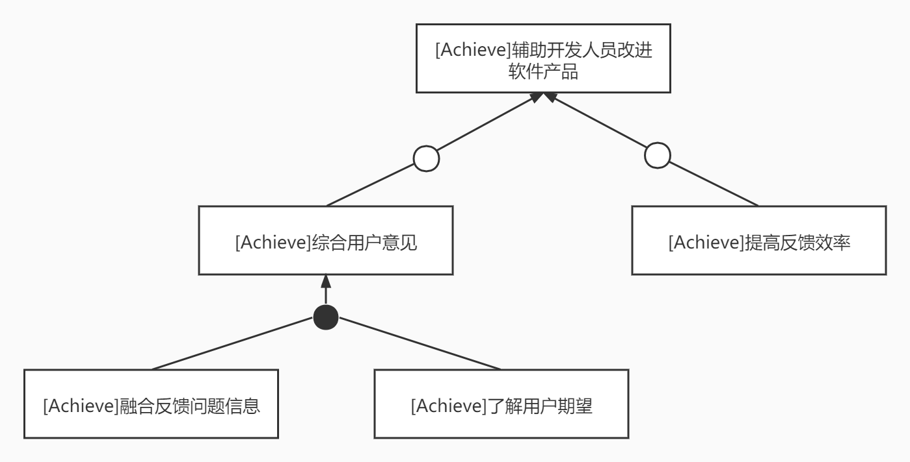
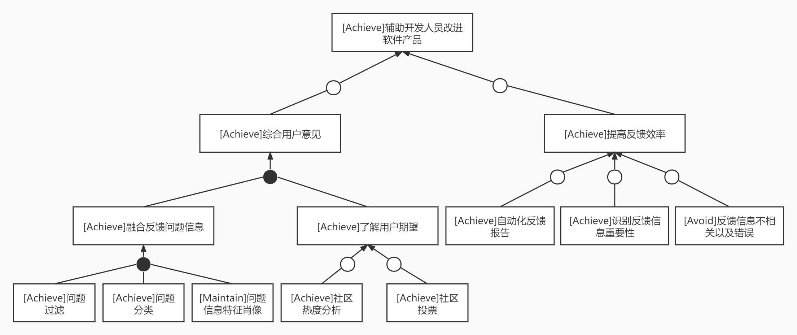
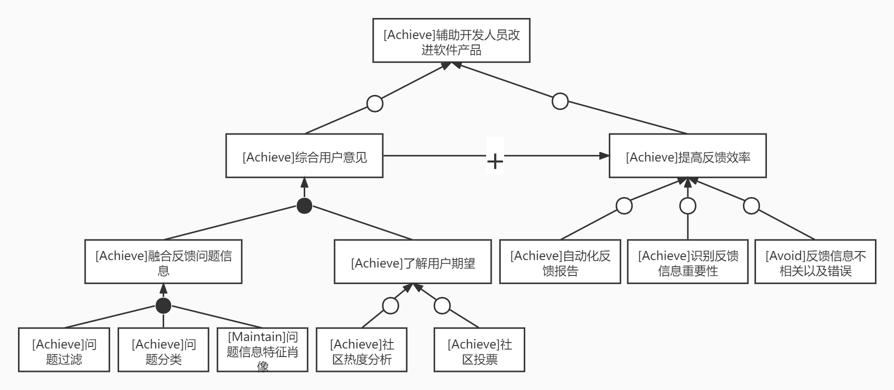
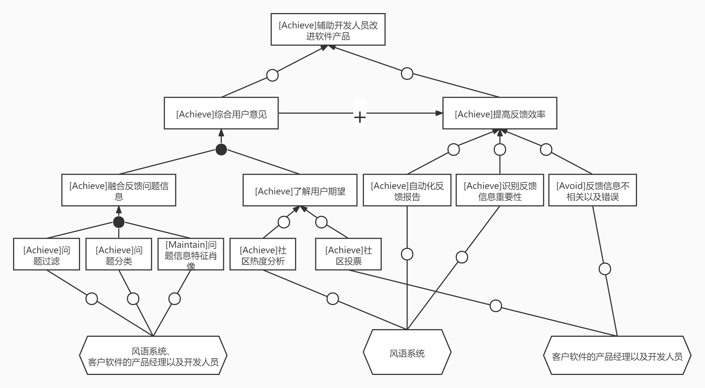
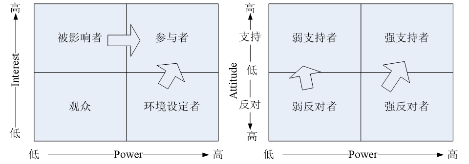

## 目标模型分析

### 2.3 辅助开发人员改进软件产品

#### 2.3.1 目标精化

要实现辅助开发人员改进软件产品高层目标，开发人员以及产品经理就必须知道用户对当前软件产品意见，提高得到反馈信息的效率。同时，用户对产品的意见可以分为问题与期望，因此我们可以得到精化初步结果：

进一步精化分析，对于提高反馈效率，我们可以通过自动化地方法来分析用户反馈信息，识别重要的用户反馈信息，综合各个用户的不同意见，自动化在一定的时间间隔内主动给开发团队提供反馈报告；为了避免目标过于理想化，考虑阻碍目标，即反馈信息不相关甚至错误来防止降低反馈效率。对于融合反馈问题信息，我们将流程细分（AND精化）为问题过滤、问题分类、维护问题信息肖像（版本相关）。对于了解用户期望，可以利用构建的社区优势，进行社区热度分析以及社区用户期望投票获取用户期望信息。

#### 2.3.2 目标冲突与协作

我们继续分析目标之间的阻碍与支持关系，精化的都希望能够得到用户的反馈，它们之间不存在相关的冲突，反而综合用户的意见信息可以进一步帮助和提高开发人员获取反馈信息的效率。

2.3.4 目标实现

最后将低层最精细的目标分配给不同主体：对于融合反馈问题信息三个子目标，风语开发团队提供反馈信息获取分类以及肖像的基本框架，客户软件的产品经理以及开发人员可以和风语开发团队联系，来定制化反馈问题的渠道，同时风语开发团队也会提供相关的接口，提供客户软件的开发人员自己定义。同时风语团队会实现自己的算法来自动化地提供反馈报告以及反馈信息重要性识别。

同样把底层目标分配给不同操作，具体如下图所示。为了实现问题过滤，需要设置过滤规则，为了进行问题分类，需要实现分类树形结构，为了维护软件问题信息的特征肖像，需要制定不同的反馈维度。在了解用户期望方面，需要进行社区热度实时分析，同时发起投票了解用户期望。最后，自动化反馈报告需要信息汇总，识别反馈信息重要性需要进行频率分析，反馈信息错误需要专人识别。

## 项目环境

### 1 操作环境

ENV-1**用户地理集中情况**：系统部署在各个软件平台上，用户在地理位置上具明显的分散特点。

ENV-2**各类用户使用系统的时间状况**：

| 用户类别         | 使用时间情况                                                 |
| ---------------- | ------------------------------------------------------------ |
| 普通用户         | 使用时间分散且不确定性强，但基本处于正常白天时间。当软件发生异常错误情况、软件交互性差或者用户对软件产品有意见时，才需要使用平台的反馈功能。 |
| 平台客服         | 长时间固定使用我们的系统，使用平台知识对用户的问题进行解答。 |
| 客户软件开发团队 | 稳定部署系统作为中间件，持久收集用户反馈信息。               |

ENV-3**数据的生成与使用**：

| 数据类型       | 生成出处                                                     | 使用情况                                                     |
| -------------- | ------------------------------------------------------------ | ------------------------------------------------------------ |
| 用户个人信息   | 用户使用系统前进行个人信息认证                               | 系统会严格保证用户信息不泄露给使用系统作为中间件的软件开发者，提供反馈信息时会对用户信息进行模糊处理 |
| 用户反馈信息   | 用户使用平台对软件进行反馈                                   | 根据不同的软件开发者的要求，选择不加过滤全部提供或者使用平台的反馈筛选与自动化功能提供重要的反馈 |
| 客服知识积累   | 客服回答用户问题时的产生的知识性资源信息                     | 用于构建软件的客服信息知识库，积累客服知识帮助客服高质量回答用户问题 |
| 软件开发者代码 | 软件开发者希望定制社区时会提供专属接口，得到不同软件开发者的代码 | 保证不同开发者之间的数据不互通                               |

ENV-4访问数据时的最大响应时间：由于用户反馈以及客服回答需要实时性，从交互体验角度来看最佳为0.5s至1s

ENV-5客户能否容忍服务中断：对于普通用户，反馈服务的中断影响体验但是处于可以容忍的范围；对于软件开发者，反馈服务中断不影响关键业务，处于可容忍的状态

ENV-6是否需要提供安全控制和数据保护：无论是开发者还是用户，数据安全和保护都是强烈需要的

### 2 涉众

#### 2.1 涉众的识别

总的来说，该系统的涉众有：普通用户、软件开发商（客户）、客服（客户软件中的工作人员）、项目经理（跟进不同客户的项目进度）、开发者（开发平台和关键算法）和平台维护人员。上述的涉众中，开发人员以及维护人员并不是系统的关键涉众，因此后续不再继续讨论。

#### 2.2 涉众描述

| 涉众       | 特征                                                         | 主要目标                                                     | 态度                                                         | 主要关注点                                                   | 约束条件                       |
| ---------- | ------------------------------------------------------------ | ------------------------------------------------------------ | ------------------------------------------------------------ | ------------------------------------------------------------ | :----------------------------- |
| 普通用户   | 来自各个年龄段，为不同软件的使用者，他们可能是使用智能手机的老手，能够快速上手各类软件；也有可能他们不熟悉如何使用智能手机，对于软件的使用一窍不通，希望能够快速使用。同时有轻度使用者，他们不常使用目标软件，也有重度使用者，对于软件使用深入，对于软件有着自己的建议与理解，希望能够提出自己的建议。有的在使用的过程中遇到了问题，不知道如何解决，需要人工来帮助解决特定问题。 | 能够快速了解软件的全部功能以及使用的方式，顺畅地没有错误地帮助他们完成任务。 | 非常希望能够有一个良好的用户反馈平台以及优质的客服来帮助他们上手软件，解决使用中遇到的问题以及完成自己对于该软件使用过程中的反馈意见过程。 | 良好的用户体验                                               | 使用前需要进行信息认证         |
| 软件开发商 | 处于软件开发初创阶段，资金与人员有限，需要集中关注软件的功能需求，无法构建自己的用户反馈平台，但是十分需要用户反馈来帮助后续开发。同时希望能够给用户良好的软件使用导引。 | 得到有效地用户反馈信息来指导后续的平台开发。                 | 对平台提供的功能持友善态度，但是他们不太希望使用该平台为他们造成太大资金上的开销。 | 尽可能小的开销来获得较好的用户反馈体验来帮助开发软件，同时为用户提供使用指引 | 需要部署平台在自己的软件上使用 |
| 客服       | 为用户提供解答，但是用户提问不准确往往使得他们十分烦恼。连续十几个小时的工作以及回复繁琐重复的问题让他们工作充满了疲惫。 | 能够高效轻松的获取用户的问题以及精确地回答                   | 积极态度，希望平台的知识库能够帮助他们回答重问题             | 平台对于客服工作的效率提升程度。                             | 需要培训                       |
| 项目经理   | 平台的管理者，跟进不同客户（软件开发商）的定制化需求，完成对接与后续定制化的项目跟进工作，不断与客户进行沟通反馈 | 完成客户的要求                                               | 希望能够有项目模版来帮助完成工作                             | 保证定制化项目能够顺利进行                                   | 无                             |

#### 2.3 涉众评估

| 用户群体   | 任务                 | 群体数量                                     | 优先级 |
| ---------- | -------------------- | -------------------------------------------- | ------ |
| 普通用户   | 对软件进行信息反馈   | 多，根据平台部署不同软件来预计能达到十万以上 | 4      |
| 软件开发商 | 收集反馈信息改进软件 | 主要客户，可以达到一千以上                   | 4      |
| 客服       | 对用户问题进行解答   | 多，预计可以达到一万以上                     | 3      |
| 项目经理   | 根据定制化项目进度   | 10-15人                                      | 1      |

##### 2.3.1 风险评估

从Power/Interest分析涉众

- 参与者：**普通用户以及软件开发商**。这两类用户直接参与和系统的使用，需要和平台有具体和频繁地交互。普通用户使用反馈功能与社区来得到使用软件的指导以及反馈使用信息与意见。软件开发商使用平台作为收集反馈信息的渠道，以及提出定制化需求，直接影响平台的开发与建设。
- 环境设定者：**项目经理**。管理需要有定制化需求的软件开发商的反馈渠道项目，他们不使用平台，但是决定了项目的走向以及最终产品的形态，他们的行为影响着系统的环境。
- 被影响者：**客服**。他们作为软件的客服需要使用平台为用户提供具体解答，但是他们对平台的影响较弱；他们虽然参与到系统的使用中，但是其中的大部分人都很少有影响系统的决策。
- 观众：关键涉众中暂时不存在观众。

从Attitude/Power来分析涉众

- 强支持者：普通用户与项目经理。项目经理平台的管理者和高层人员，支持着平台的运维和发展，是平台的中坚力量。同时用户对待能够有效反馈与得到帮助的平台是十分支持的，他们不需要为该项功能付费就能够得到良好的反馈以及使用软件的引导。
- 弱支持者：客服。他们希望平台能够解决他们工作中的困难，减少重复问题的回答，但是他们处于被雇佣的地位，对平台没有决定性作用。
- 弱反对者：暂未发现平台的弱反对者。
- 强反对者：软件开发商。他们会对平台持观望态度，由于项目初步启动资金不足，无法构建自己的反馈社区，但是在版本迭代过程中又亟需用户的反馈，但是他们可能会对平台的使用费用以及反馈信息的有效性产生担忧，产生反对应用平台中间件的态度。

风险化解：对于持有观望甚至反对态度的软件开发商，可以加强宣传，或提供一定程度的免费使用功能，同时主动帮助他们部署平台在他们的软件中；在后续跟进过程中，拿出应用平台的优势数据证据，令他们向强支持者转化。

##### 2.3.2 共赢分析

从涉众对系统的期待中提取出了三个重要问题：反馈及时有效、反馈渠道构建成本、社区维护。我们可以看到无论是用户和软件开发商，都希望对于反馈能够及时达到，其中软件开发商的需求更为迫切。对于客服，用户反馈的问题他们更希望能够减少重复性的工作，希望系统能够提升他们工作的效率。这三者在此方面并没有冲突，可以共赢，平台可以为他们搭建良好的反馈系统。对于社区维护，用户当然希望能够有良好的社区来获得使用软件的产品交流体验经历，同时希望避免社区中存在无效信息，希望社区可以维护好，但是软件开发商则希望减少社区维护投入成本，更希望有社区中有用户来组织自发维护社区，降低成本。在此问题上用户和软件开发商存在着一定的冲突，但不至于不可调节。对于反馈渠道构建成本，开发商希望能够越低越好，平台的项目经理要保证成本范围，两者在此方面是一致的。

对于社区维护，平台可能需要介入来保证社区内容的质量。一个良好的社区是软件开发商获取反馈以及用户来反馈的可选途径，为了调节两者的冲突，平台需要一定的介入，在减少软件开发商介入的同时，满足用户对于高质量社区的要求。

## 用例分析

| ID       | 3.1                                                          |
| -------- | ------------------------------------------------------------ |
| 名称     | 自定义反馈信息                                               |
| 优先级   | 中                                                           |
| 参与者   | 产品侧开发人员，目标是自定义反馈信息                         |
| 触发条件 | 无                                                           |
| 前置条件 | 产品侧开发人员与风雨平台联系请求自定义反馈信息               |
| 后置条件 | 产品反馈信息规则更改                                         |
| 正常流程 | 1. 产品测开发人员获取风语平台反馈接口 2. 风语平台提供现有的反馈信息实现接口文档 3. 产品侧开发人员分析接口，实现自定义的反馈信息方法 |
| 扩展流程 | 无                                                           |
| 业务规则 | 无                                                           |
| 特殊需求 | 无                                                           |

| ID       | 3.2                                                          |
| -------- | ------------------------------------------------------------ |
| 名称     | 获取反馈报告                                                 |
| 优先级   | 高                                                           |
| 参与者   | 产品侧开发人员                                               |
| 触发条件 | 产品侧开发人员要求提供反馈报告                               |
| 前置条件 | 无                                                           |
| 后置条件 | 平台产生反馈报告                                             |
| 正常流程 | 1. 产品侧开发人员要求获得反馈报告 2. 风语平台提示输入时间段，选择产品功能选项  3. 产品侧开发人员输入时间段，选择产品功能 4. 风语平台要求确认 5. 产品侧开发人员确认 6. 风语平台产生对应的反馈信息报告 |
| 扩展流程 | 6a. 报告导出       1. 开发人员请求导出报告       2. 风语系统导出报告 |
| 业务规则 | 无                                                           |
| 特殊需求 | 导出报告格式可以自行选择为docx，pdf                          |

| ID       | 3.3                                                          |
| -------- | ------------------------------------------------------------ |
| 名称     | 查看用户反馈信息                                             |
| 优先级   | 高                                                           |
| 参与者   | 产品侧开发人员                                               |
| 触发条件 | 产品侧开发人员要求提供每个用户的反馈信息                     |
| 前置条件 | 无                                                           |
| 后置条件 | 平台提供反馈信息列表                                         |
| 正常流程 | 1. 产品侧开发人员要求查看用户反馈信息 2. 风语平台返回用户反馈信息按时间排序列表 |
| 扩展流程 | 2a. 关键字查找       1. 开发人员输入关键字，选择查找       2. 风语系统给出含关键字的反馈信息条目列表，并且在每个条目中标注出关键字 2b. 条目导出       1. 开发人员请求导出列表       2. 风语系统导出列表 2c. 按照重要程度排序       1. 开发人员请求按照信息重要程度排序       2. 风语系统按照预设的算法得到排序好的列表 |
| 业务规则 | 无                                                           |
| 特殊需求 | 重要程度算法在用例自定义反馈信息中可以设置，也可以选择系统默认算法 |

| ID       | 3.4                                                          |
| -------- | ------------------------------------------------------------ |
| 名称     | 发起社区投票                                                 |
| 优先级   | 低                                                           |
| 参与者   | 产品侧开发人员                                               |
| 触发条件 | 无                                                           |
| 前置条件 | 产品侧开发人员进入社区并且已经登录认证成功                   |
| 后置条件 | 社区增加投票帖子                                             |
| 正常流程 | 1. 产品侧开发人员请求发起投票 2. 风语平台提示产品侧开发人员输入产品功能，投票设置以及投票选项  3. 产品侧开发人员输入对应信息，请求发布 4. 风语平台提示确认 5. 产品侧开发人员完成确认 6. 风语平台提示发布成功 |
| 扩展流程 | 6a. 查看社区投票情况       1. 产品侧开发人员请求查看投票情况       2. 风语系统给出实时投票反馈情况 |
| 业务规则 | 产品侧开发人员无法查看具体用户信息，只允许查看票数           |
| 特殊需求 | 无                                                           |

### 系统用例图

