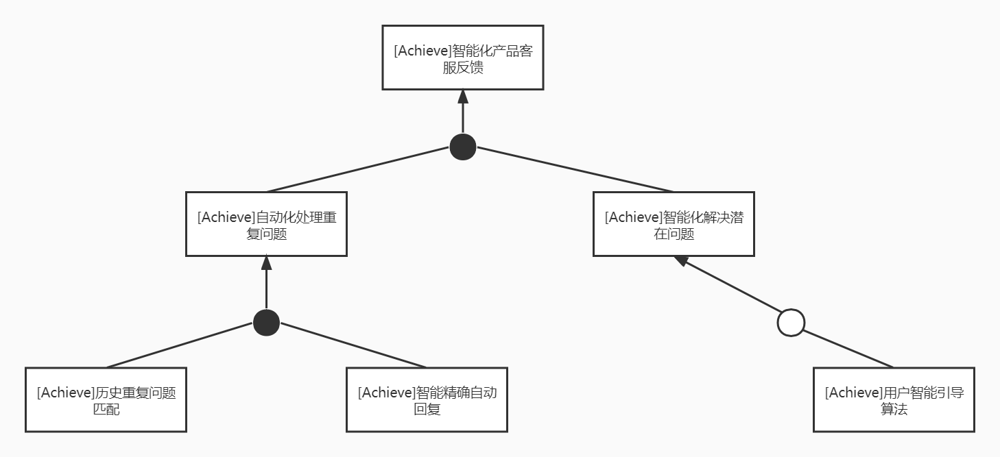
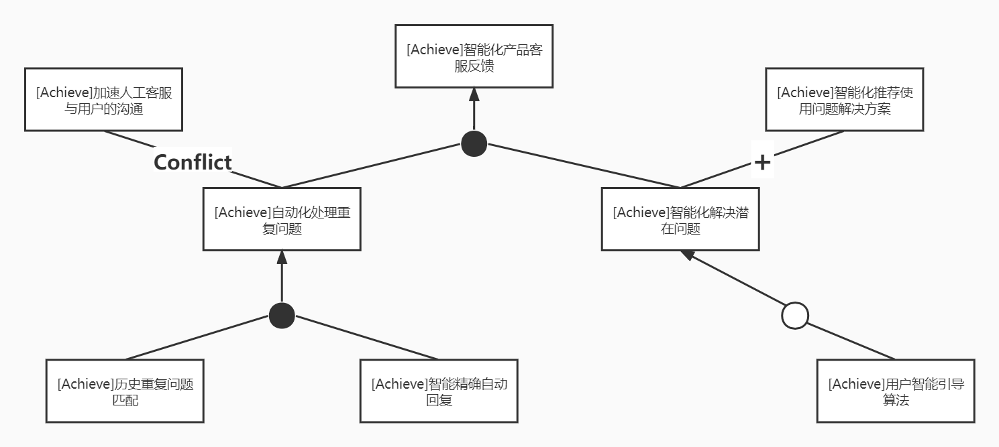
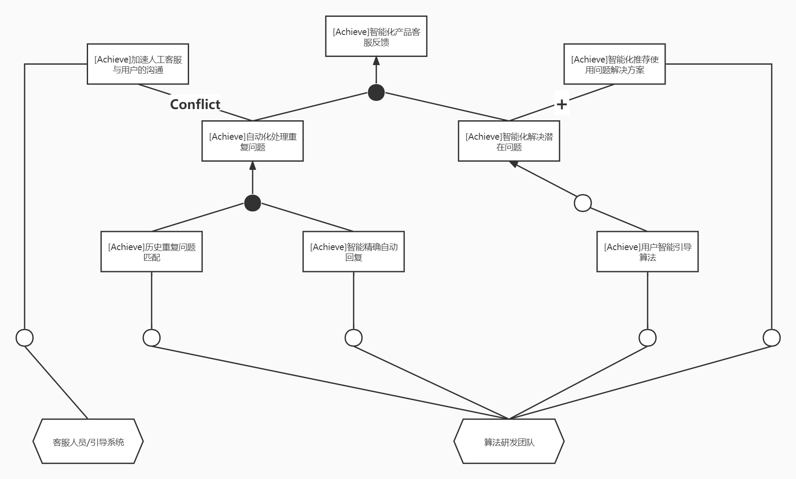
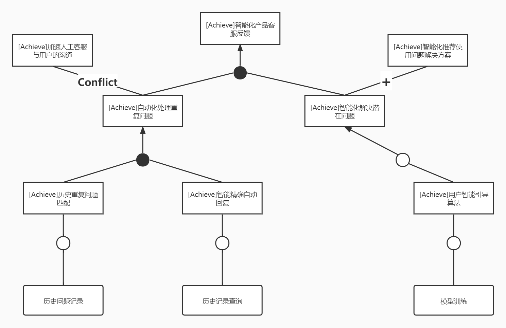
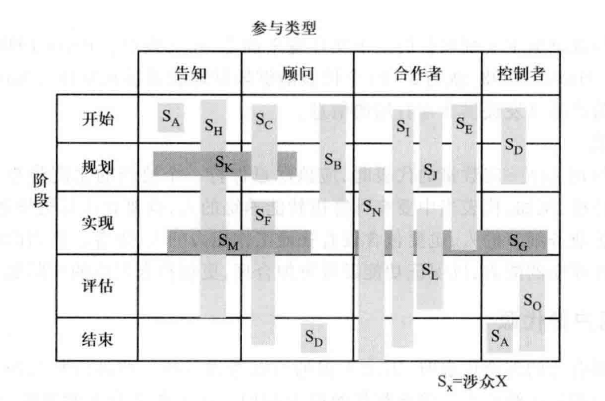
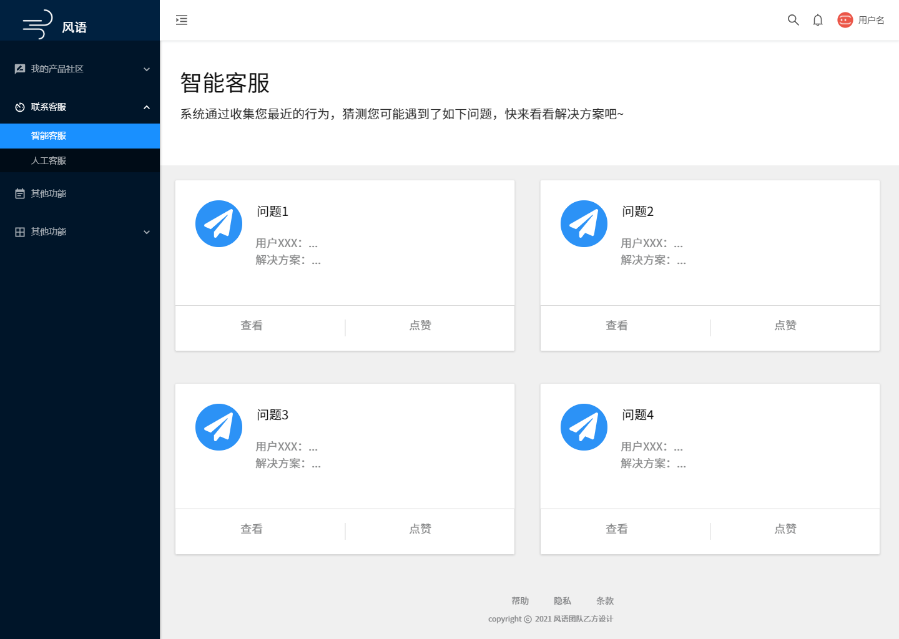
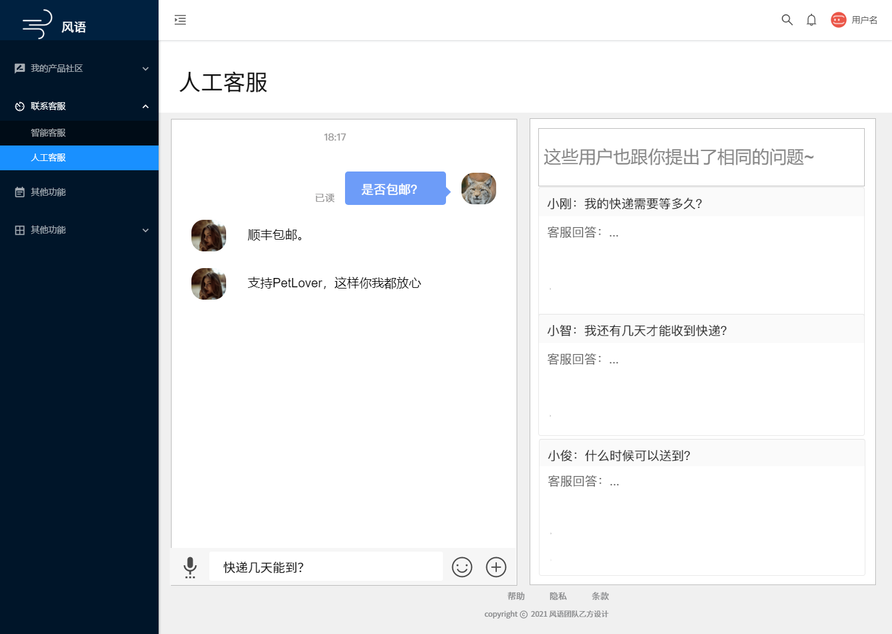

## TODO

### 第一阶段

- 目标模型分析
  - 目标模型：智能化产品客服反馈（用户侧与产品侧的交流反馈）
- 项目前景与范围
  - 项目环境
    - 项目属性
    - 涉众分析：涉众代表选择、涉众参与策略制定、使用目标模型进行涉众分析

### 面谈对话参考

- 你们提到的提供中间件的相关服务，主要靠什么算法解决用户和客服的痛点？

- 用户智能引导算法。在客服侧，致力于解决大量重复问题和请求堆到人工客服（指使用《风语》的开发团队中的客服）处，因此算法会将历史中用户的提问和客服的回答以及社区反馈进行知识积累；在用户侧，致力解决智能客服不能给予用户以有效建议，而等待人工客服时间可能较长的痛点，通过知识积累将用户的提问和相关的知识进行整合，帮助用户解决问题。

### 第二阶段

- 自己负责目标模型对应的用例总结
- 自己负责目标模型对应的系统用例图
  - 用户名称统一规范：软件产品用户、产品侧开发人员、产品侧客服人员、系统管理员

- 自己负责目标模型对应的原型设计
  - 寻求客服反馈页面、与客服聊天页面

- 基于用例/场景的用户需求文档的用户需求列表，我的理解就是将每个用例转化为用户需求，可以等大家的用力都写完都完成后再搞
- 自己负责目标模型对应的用例描述

## 2 目标模型分析

### 2.4 智能化产品客服反馈

#### 2.4.1 目标精化

智能化产品客服反馈这一高层目标主要是为了解决使用《风语》平台的团队中的人工客服的痛点，可以细分为“自动化处理重复问题”和“智能化解决潜在问题”。自动化处理重复问题可以让人工客服从机械性地处理大量重复的用户问题中脱身，从而降低人工客服的工作量，让他们能够更高效地去回答更有价值的问题。而智能化解决潜在问题是指在用户给人工客服提出问题之前，自动给用户推荐解决方案，从而减少真正需要让人工客服去处理的问题的数量。由此可精化为AND关系下的子目标。

再次进行细分。对于自动化处理重复问题，主要目标就是系统通过识别用户提出的问题，自动匹配人工客服以往回答过的问题，筛选出匹配度较高的进行自动回复，因此可以细分为“历史重复问题匹配”与“智能精确自动回复”（AND精化）。对于智能化解决潜在问题，可以通过实现用户智能引导算法来解决，因此可以细分为“用户智能引导算法”（OR精化）。

#### 2.4.2 目标冲突与协作

根据进一步对整体目标的分析，我们识别出了一些其他目标，如智能化推荐使用问题解决方案、加速人工客服与用户的沟通等。但在加速人工客服与用户的沟通时，往往需要同步自动指派软件产品客服即时解决用户问题、实现用户预定时间软件产品客服解决问题，这与自动化处理重复问题的目标产生冲突；而“智能化推荐使用问题解决方案”的目标是“智能化解决潜在问题”目标在用户侧的表现形式，体现了目标间的协作。

#### 2.4.3 目标实现

最后将低层最精细的目标分配给不同主体：为了实现历史重复问题匹配、智能精确自动回复、用户智能引导算法和智能化推荐使用问题解决方案，需要有算法研发团队；要达到加速人工客服与客户的沟通，还需要有专业的客服团队和引导系统进行定制引导。

同时设计最底层目标的操作：为实现历史重复问题匹配，需要进行历史问题记录；此外，为实现智能精确自动回复，需要实现历史记录查询；最后，为了实现用户智能引导算法，需要使用机器学习的相关知识，去训练相应的模型。

## 3 项目前景与范围

### 3.4项目环境

#### 3.4.2 涉众

##### 3.4.2.4 涉众代表选择

我们将涉众主要分为4个类别：普通用户、软件开发商、客服、项目经理。

普通用户、软件开发商、客服这 3 类涉众群体的人数较多（10 人以上），我们需要进行采样的方法，在每个涉众群体中分别选择一部分较少的人，尽量可以准确代表群体中的所有人。我们要保证完整采样， 即这三种涉众群体都有自己的代表；涉众群体的代表应保持积极的态度向我们提供需求；每个涉众群体代表的数量适中，约为 5-10 个，要保证体现出整个涉众群体的共同看法同时也要保证效率；涉众代表中也要有明显的个人特征，比如选择不同年龄层，不同领域软件的用户、软件开发商和客服；要有计算机技能熟练的人，也要有计算机技能不太精通的人。

在项目经理这个群体中，群体人数比较少，可以考虑让这个涉众群体的所有人都参与到需求的开发中来，都是本类别的代表。

##### 3.4.2.5 涉众参与策略制定

在选择了合适的涉众代表之后，还要让他们参与软件开发的过程，为软件系统的成功贡献力量。我们事先安排好代表们的参与时间、强度与内容，让他们可以更好地提前安排自己的工作。为此，可以建立一个如下图所示的涉众参与矩阵，作为涉众代表参与软件开发过程的基本策略。

在图中，普通用户、客服、项目经理可以视为图中的SO。他们是平台的主要使用者，普通用户和客服需要平台提供的服务，项目经理需要平台所提供的反馈，他们都需要平台简洁易用。这三类涉众在计算机方面的知识可能比较欠缺，不需要参与系统的实现设计中来，只需要在实现后进行评估试用即可。

而软件开发商可以视为图中的SL。这一类涉众比较精通软件开发方面的知识，可以参与软件的实现阶段，可以为SDK的开发提出建议。同时，他们也是SDK的使用者，在评估阶段也需要他们对SDK的稳定性及易用性进行评估。

##### 3.4.2.6 使用目标模型进行涉众分析

目标模型能够有效、深人地描述目标、策略信息，所以使用拥有者的目标模型能够更深人地描述涉众特征。拥有者的目标模型已在“2 目标模型分析”中给出，此处不再赘述。

基于拥有者的目标模型，可以更好地执行涉众评估：有利于根据目标的优先级安排主体的优先级；有利于根据目标的风险确定主体的风险；有利于根据目标分析深人分析主体间的互动。因此，我们在涉众分析的第三部分“涉众评估”中，已经使用了目标模型进行涉众分析。

#### 3.4.3 项目属性

| 属性 | 驱动因素                                                     | 约束因素                                                     | 可调整因素                                                   |
| ---- | ------------------------------------------------------------ | ------------------------------------------------------------ | ------------------------------------------------------------ |
| 进度 |                                                              |                                                              | 计划 3 个月内完成第一版；视营收情况，6 至 12 个月内逐步完成第二版内容。在不包括责任人评审的情况下，最多可超过期限3个星期 |
| 特性 |                                                              | 第一版中要求实现的特性必须完全可操作                         |                                                              |
| 质量 |                                                              | 必须通过95%的用户验收测试；必须通过全部的安全性测试；所有的安全事务都必须遵守公司的安全标准 |                                                              |
| 人员 | 团队规模包括一名兼职的项目经理、五名开发人员和一名兼职的测试人员；如果有必要，还可以再增加兼职的开发人员 |                                                              |                                                              |
| 费用 |                                                              |                                                              | 在不包括责任人评审的情况下，财政预算最多可超支15%            |

## 第二阶段

### 用例提取

- 目标模型：智能化产品客服反馈
- 用例列表
  - 软件产品用户
    - 使用智能客服
    - 咨询人工客服
  - 产品侧客服人员
    - 回答用户问题

### 对应目标模型的系统用例图

### 对应目标模型的用例描述

| ID       |                                                              |
| -------- | ------------------------------------------------------------ |
| 名称     | 使用智能客服                                                 |
| 优先级   | 高                                                           |
| 参与者   | 软件产品用户，目标是解决当前使用软件遇到的问题               |
| 触发条件 | 软件产品用户进入联系客服的页面                               |
| 前置条件 | 用户进入风语平台并以软件产品用户登录                         |
| 后置条件 | 系统将推荐结果是否正确的结果存入数据库，便于模型训练         |
| 正常流程 | 1、软件产品用户进入联系客服的页面 2、系统通过用户最近的行为，自动推荐解决方案 3、软件产品用户判断解决方案有帮助 4、软件产品用户退出当前界面 |
| 拓展流程 | 3a、用户认为当前解决方案无帮助： 1、系统提示咨询人工客服  |
| 业务规则 | 无                                                           |
| 特殊需求 | 推荐解决方案的数量应该为1到4个                               |

| ID       |                                                              |
| -------- | ------------------------------------------------------------ |
| 名称     | 咨询人工客服                                                 |
| 优先级   | 高                                                           |
| 参与者   | 软件产品用户，目标是解决当前使用软件遇到的问题               |
| 触发条件 | 软件产品用户进入联系客服的页面                               |
| 前置条件 | 用户进入风语平台并以软件产品用户登录                         |
| 后置条件 | 无                                                           |
| 正常流程 | 1、软件产品用户进入咨询人工客服的页面 2、系统实时分配一名客服人员进入聊天 3、软件产品用户输入需要咨询的问题 4、系统显示历史提问数据，包括其他用户问过的类似问题以及客服的回答 5、软件产品用户点击发送 6、系统显示客服人员的回答 系统重复3-6步，直到软件产品用户完成咨询 |
| 拓展流程 | 4a、用户退出聊天： 1、系统结束当前聊天                    |
| 业务规则 | 无                                                           |
| 特殊需求 | 无                                                           |

| ID       |                                                              |
| -------- | ------------------------------------------------------------ |
| 名称     | 回答用户问题                                                 |
| 优先级   | 高                                                           |
| 参与者   | 产品侧客服人员，目标是帮助软件产品用户解决当前遇到的问题     |
| 触发条件 | 产品侧客服人员进入聊天                                       |
| 前置条件 | 客服人员已被认证并登录                                       |
| 后置条件 | 系统将客服人员的回答保存到数据库，作为历史知识               |
| 正常流程 | 1、产品侧客服人员进入与用户聊天的页面 2、系统显示当前用户提出的问题 3、产品侧客服人员输入回答并发送 系统重复2-3步，直到软件产品用户完成咨询 |
| 拓展流程 | 无                                                           |
| 业务规则 | 无                                                           |
| 特殊需求 | 无                                                           |

### 原型

#### 1.智能客服页面（寻求客服反馈页面）

#### 2.人工客服页面（与客服聊天页面）

