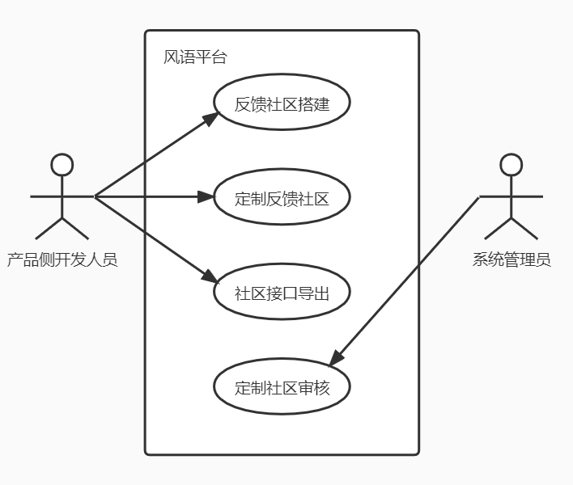
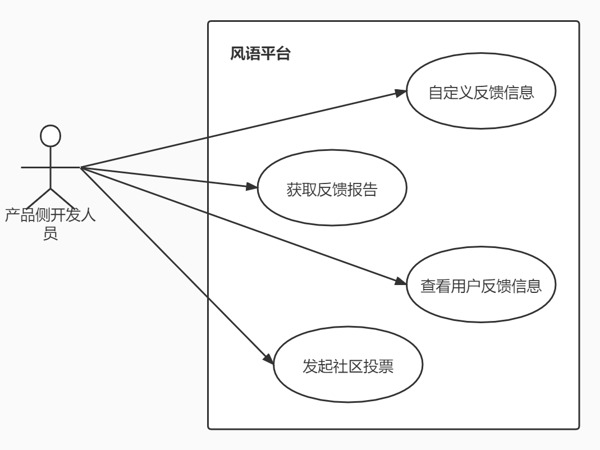
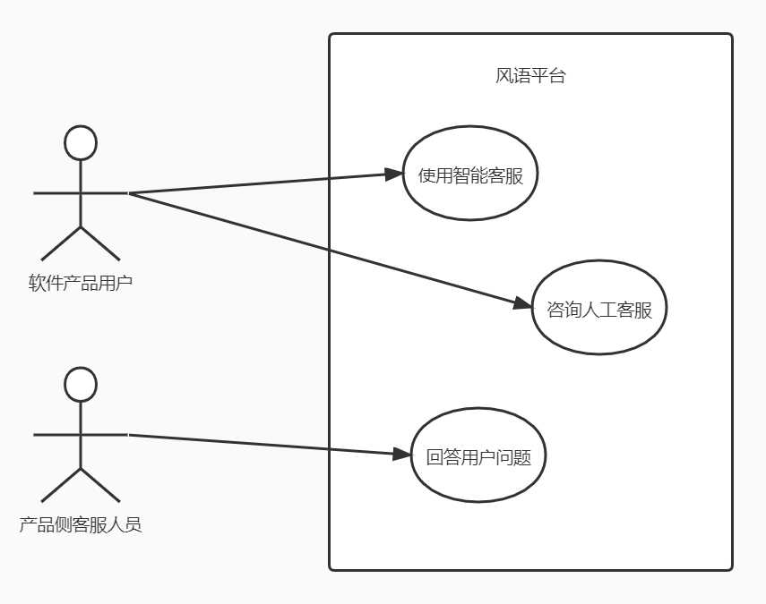

# 
风语平台项目需求获取文档

项目成员：

姬筠刚 191250055（PM）

陈梓俊 191250016

丁炳智 191250024

刘庭烽 191250093

2021年12月30日

## 目录

[TOC]

## 〇、前言

### 1.简介

​		本项目名为风语——一站式用户反馈和帮助平台，是PetLover小组在2021 年秋季学期《需求与商业模式创新》课程大作业中作为乙方经手的需求获取与需求规格说明项目。此文档为需求获取文档，在对风语整体商业模式有了初步的了解后，我们与甲方进行了面谈并得到了需求获取文档，主要内容包括需求获取安排计划书、目标模型分析、项目前景与范围、面谈报告和用户需求文档。

### 2.度量数值

​		本次需求获取覆盖了原商业模式的16/43个要点，约为37%，其中覆盖了右侧感性端要点数为11点，左侧理性端要点数为5点，完成了 IP 场景集合下风语平台最独特的功能与对应的完整用户-系统互动；总计与甲方进行了5次面谈，提取了18个用户用例；在面谈过程中对系统页面原型进行了设计，并获得了甲方的认可。

## 一、需求获取安排计划书

​		为了明确风语项目甲方的需求，我们计划通过面谈的方式进行需求获取，我们计划执行5次面谈，以下面谈计划将在面谈开始前1-2天向甲方确认。

### 1.第一次面谈安排

- 会见者：姬筠刚、丁炳智、陈梓俊、刘庭烽。
- 被会见者：冯国豪、单金明、贺伟、郭瀚宇。
- 预计会见地点：麦当劳（广州路店）
- 预计会见时间：2021年12月15日 15:00
- 面谈目的：问题确认与目标分析，初步讨论项目前景与范围

### 2.第二次面谈安排

- 会见者：姬筠刚、丁炳智、陈梓俊、刘庭烽。
- 被会见者：冯国豪、单金明、贺伟、郭瀚宇。
- 预计会见地点：麦当劳（广州路店）
- 预计会见时间：2021年12月18日 19:00
- 面谈目的：确认项目前景与范围，项目高层设计

### 3.第三次面谈安排

- 会见者：姬筠刚、丁炳智、陈梓俊、刘庭烽。
- 被会见者：冯国豪、单金明、贺伟、郭瀚宇。
- 预计会见地点：麦当劳（广州路店）
- 预计会见时间：2021年12月22日 15:00
- 面谈目的：确认业务需求与解决方案

### 4.第四次面谈安排

- 会见者：姬筠刚、丁炳智、陈梓俊、刘庭烽。
- 被会见者：冯国豪、单金明、贺伟、郭瀚宇。
- 预计会见地点：麦当劳（广州路店）
- 预计会见时间：2021年12月25日 18:00
- 面谈目的：进一步确认用户需求与系统特性，讨论原型设计

### 5.第五次面谈安排

- 会见者：姬筠刚、丁炳智、陈梓俊、刘庭烽。
- 被会见者：冯国豪、单金明、贺伟、郭瀚宇。
- 预计会见地点：线上腾讯会议
- 预计会见时间：2021年12月27日 16:00
- 面谈目的：项目原型确认

## 二、目标模型分析

### 1.便利软件产品用户解决问题与反馈

#### 1.1 目标精化

​		便利软件产品用户解决问题与反馈这一高层目标是采用“用户交流反馈社区”的模式来加快用户问题的解决。我们需要将便利软件产品用户解决问题与反馈这一高层目标细分为智能化推荐使用问题解决方案、加速人工客服与用户的沟通、自动化收集用户优质反馈。智能化推荐使用问题解决方案是提高用户体验的关键目标，用户可以摒弃冗长的使用说明文档快速解决软件产品使用问题；加速人工客服与用户沟通可以让用户不再与机器人进行大量无用的沟通，为用户提供更高质量的服务；自动化收集用户优质反馈可以让开发人员及时看到反馈信息，同步用户反馈与开发人员作出相应恢复动作。由此精华为AND关系下的子目标：

​		对主目标的子目标进行精化：对于智能化推荐使用问题解决方案可细分为收集用户软件产品使用数据、基于用户行为分析智能推荐辅助方案（AND精化），其中前者为后者的前驱；对于加速人工客服与用户的沟通可进一步精化为同步自动指派软件产品客服即时解决用户问题、实现用户预定时间软件产品客服解决问题（OR精化），以此来节省用户时间；对于自动化收集用户优质反馈我们将其进一步精化为快速筛选优质反馈、定期汇总为产品报告（AND精化）：

#### 1.2 目标冲突与协作

​		根据进一步对整体目标的分析，我们识别出了一些其他目标：保证基于用户行为分析的智能推荐算法的可靠性和兼顾多数用户的使用反馈。其中保证基于用户行为分析的智能推荐算法的可靠性与能化推荐使用问题解决方案两个目标一致，可以相互协作；但自动化收集用户优质反馈会忽略掉如吐槽式等帮助不大的反馈，这与兼顾多数用户的使用反馈目标产生冲突。如下：

#### 1.3 目标实现

​		最后将低层最精细的目标分配给不同主体：为了实现收集用户软件产品使用数据、基于用户行为分析智能推荐辅助方案、保证基于用户行为分析的智能推荐算法的可靠性、快速筛选优质反馈、定期汇总为产品报告，我们需要专门的数据分析和算法研发团队；要达到同步自动指派软件产品客服即时解决用户问题或实现用户预定时间软件产品客服解决问题的目标，还需要有专业的客服团队和引导系统进行定制引导。如下：

​		同时设计最底层目标的操作：为了实现收集用户软件产品使用数据，需要进行用户数据收集；为了实现基于用户行为分析智能推荐辅助方案，需要数据分析和智能推荐算法研发；为了保证基于用户行为分析的智能推荐算法的可靠性，需要定期对其进行测试与维护；为了快速筛选优质反馈，需要无用反馈过滤算法研发；为了定期汇总为产品报告，需要整合优质反馈并格式化；为了同步自动指派软件产品客服即时解决用户问题或实现用户预定时间软件产品客服解决问题，需要开发客服调度或客服预定功能。如下：

### 2.帮助开发人员快速定制化产品交流社区

#### 2.1 目标精化

​		要实现帮助开发人员快速定制化产品交流社区这一高层次目标，可以将其细分为提升搭建社区的效率以及社区搭建定制化。提升搭建社区的效率对产品初期迭代开发中具有重要意义，产品团队可以及时得到用户反馈，并在下次迭代中作出相应调整；社区搭建的定制化则可以在一定程度上避免用户对产品的反馈过于分散的问题，同时为用户提供可靠的反馈渠道，避免产品团队陷入搞不清需求真伪、过度设计的误区。由此，精华为AND关系下的子目标。

​		再次进行细分，对于提升搭建社区效率，主要目标就是希望有一个开发团队可以直接调取的接口，利用此接口即可自动化地构建出对应产品的交流社区（OR精化）；对于社区搭建定制化来说，主要可以分为两个子目标，一是社区产品专属化，即通过调用接口构建的社区只服务于本产品，并帮助产品在后续开发过程中及时得知用户反馈并进行改进，二是社区功能定制化，即产品团队可以根据在不同迭代周期对产品交流社区的不同需求对搭建的社区进行功能定制，从而满足产品开发的渐进需求（AND精化）。

#### 2.2 目标冲突与协作

​		根据进一步对整体目标的分析，我们识别出了一些其他目标，如简化产品社区搭建的流程以达到“快速”搭建的目的，以及保持风语SDK的可靠性、稳定性等。但在社区搭建定制化的过程中，往往需要使用者进行较为详细化的功能搭配、筛选等，与简化搭建流程的目标产生冲突；保持风语SDK的可靠性和稳定性则是提升搭建社区效率的一项保证，体现了目标间的协作。

#### 2.3 目标实现

​		最后将低层最精细的目标分配给不同主体：为了提供SDK以供开发者团队自动化搭建产品交流社区，并保证SDK的可靠性和稳定性，需要有专业的SDK开发和维护团队；要达到社区功能定制化和社区产品专属化的目标，还需要有专业的客服团队和引导系统进行定制引导。

​		同时设计最底层目标的操作：为实现通过接口自动化搭建产品交流社区的目标，需要进行SDK中间件开发；为保持SDK的可靠性和稳定性，需要对其进行维护和更新；同时为了实现社区产品专属化的目标，就要保证不同产品社区之间的隔离以及资源的合理分配；最后，为了实现社区功能定制化，SDK需要提供定制功能。

### 3.辅助开发人员改进软件产品

#### 3.1 目标精化

​		要实现辅助开发人员改进软件产品高层目标，开发人员以及产品经理就必须知道用户对当前软件产品意见，提高得到反馈信息的效率。同时，用户对产品的意见可以分为问题与期望，因此我们可以得到精化初步结果：

​		进一步精化分析，对于提高反馈效率，我们可以通过自动化地方法来分析用户反馈信息，识别重要的用户反馈信息，综合各个用户的不同意见，自动化在一定的时间间隔内主动给开发团队提供反馈报告；为了避免目标过于理想化，考虑阻碍目标，即反馈信息不相关甚至错误来防止降低反馈效率。对于融合反馈问题信息，我们将流程细分（AND精化）为问题过滤、问题分类、维护问题信息肖像（版本相关）。对于了解用户期望，可以利用构建的社区优势，进行社区热度分析以及社区用户期望投票获取用户期望信息。

#### 3.2 目标冲突与协作

​		我们继续分析目标之间的阻碍与支持关系，精化的都希望能够得到用户的反馈，它们之间不存在相关的冲突，反而综合用户的意见信息可以进一步帮助和提高开发人员获取反馈信息的效率。

#### 3.3 目标实现

​		最后将低层最精细的目标分配给不同主体：对于融合反馈问题信息三个子目标，风语开发团队提供反馈信息获取分类以及肖像的基本框架，客户软件的产品经理以及开发人员可以和风语开发团队联系，来定制化反馈问题的渠道，同时风语开发团队也会提供相关的接口，提供客户软件的开发人员自己定义。同时风语团队会实现自己的算法来自动化地提供反馈报告以及反馈信息重要性识别。

​		同样把底层目标分配给不同操作，具体如下图所示。为了实现问题过滤，需要设置过滤规则，为了进行问题分类，需要实现分类树形结构，为了维护软件问题信息的特征肖像，需要制定不同的反馈维度。在了解用户期望方面，需要进行社区热度实时分析，同时发起投票了解用户期望。最后，自动化反馈报告需要信息汇总，识别反馈信息重要性需要进行频率分析，反馈信息错误需要专人识别。

### 4.智能化产品客服反馈

#### 4.1 目标精化

​		智能化产品客服反馈这一高层目标主要是为了解决使用《风语》平台的团队中的人工客服的痛点，可以细分为“自动化处理重复问题”和“智能化解决潜在问题”。自动化处理重复问题可以让人工客服从机械性地处理大量重复的用户问题中脱身，从而降低人工客服的工作量，让他们能够更高效地去回答更有价值的问题。而智能化解决潜在问题是指在用户给人工客服提出问题之前，自动给用户推荐解决方案，从而减少真正需要让人工客服去处理的问题的数量。由此可精化为AND关系下的子目标。

​		再次进行细分。对于自动化处理重复问题，主要目标就是系统通过识别用户提出的问题，自动匹配人工客服以往回答过的问题，筛选出匹配度较高的进行自动回复，因此可以细分为“历史重复问题匹配”与“智能精确自动回复”（AND精化）。对于智能化解决潜在问题，可以通过实现用户智能引导算法来解决，因此可以细分为“用户智能引导算法”（OR精化）。

#### 4.2 目标冲突与协作

​		根据进一步对整体目标的分析，我们识别出了一些其他目标，如智能化推荐使用问题解决方案、加速人工客服与用户的沟通等。但在加速人工客服与用户的沟通时，往往需要同步自动指派软件产品客服即时解决用户问题、实现用户预定时间软件产品客服解决问题，这与自动化处理重复问题的目标产生冲突；而“智能化推荐使用问题解决方案”的目标是“智能化解决潜在问题”目标在用户侧的表现形式，体现了目标间的协作。

#### 4.3 目标实现

​		最后将低层最精细的目标分配给不同主体：为了实现历史重复问题匹配、智能精确自动回复、用户智能引导算法和智能化推荐使用问题解决方案，需要有算法研发团队；要达到加速人工客服与客户的沟通，还需要有专业的客服团队和引导系统进行定制引导。

​		同时设计最底层目标的操作：为实现历史重复问题匹配，需要进行历史问题记录；此外，为实现智能精确自动回复，需要实现历史记录查询；最后，为了实现用户智能引导算法，需要使用机器学习的相关知识，去训练相应的模型。

## 三、项目前景与范围

### 1.业务需求

#### 1.1项目背景

​		软件的运行维护是软件生命周期的重要组成部分，而且根据调查表明，软件维护成本已占到整个软件生命周期成本的70%以上。软件经过测试问世后不一定会真正满足真实世界客户的需求，甚至在投入使用后BUG层出不穷，因此在软件产品发布（测试版本或正式版本发布）后，面向用户和开发人员及产品经理建立一个沟通的渠道，在产品侧高效地寻找并修复软件、满足用户真实需求、提高软件性能或其他属性，在用户侧高效地帮助用户软件解决使用问题，这在软件运行维护过程中至关重要。

​		站在产品侧考虑，很多软件产品都会设置FAQ（Frequently Asked Questions）入口或软件问题反馈入口，如果这样的反馈入口设计简陋又会饱受用户诟病，如果设计精良会增加开发人员的开发负担，而且由于反馈的低门槛，很多无用反馈会产生，只要允许用户反馈的地方，用户对产品的任何地方都会吐槽和谩骂，因此反馈系统仍需帮助开发人员和产品经理有效地筛选用户反馈，系统化地把反馈变成可靠的建议和创建需求的论据，从而对软件产品做进一步改进。

​		站在用户侧考虑，用户为了在使用软件产品的过程，可能需要阅读冗长的使用说明文档，因此他们需要这样的问答渠道来解决他们在软件产品使用过程中的问题以及反馈他们对软件维护的反馈意见。

#### 1.2业务机遇

​		风语平台针对上述的背景进入的市场是帮助企业与开发人员快速搭建用户反馈与帮助社区的市场。根据甲方提供资料以及本开发团队的社会调研显示：当前很多开发团队使用敏捷软件开发的开发模式，快速部署软件服务来抢占市场，长周期的软件开发无法适应现在的市场需求，消除软件开发中的冗余步骤、轻量化软件非核心内容十分重要；另外由于互联网+时代同种类软件服务众多，它们比拼的不仅仅有产品功能，还有产品的友好度与反馈服务。为了使软件快速迭代上线且提供用户反馈和帮助的平台，多数中小型软件开发团队使用第三方的反馈系统。随着机器学习等理论技术的发展，融合人工智能技术、筛选合理的用户反馈、高效帮助解答用户使用问题是第三方反馈系统未来发展趋势。风语平台基于蓝海战略融合一站式的帮助和反馈社区平台、后台数据智能分析与展示、平台咨询服务、平台个性化定制，目前市场上没有影响力较大的融合“后台数据只能分析和展示”服务的第三方反馈系统，而且大多反馈系统（如腾讯兔小巢）无法做到个性化定制，它们大多为了兼容大多产品泛用性高、模式单一、无法筛选优质用户反馈，而风语平台恰恰把握了这一机遇，提供中小型软件开发团队更加完善且高效的用户反馈和帮助社区功能。

#### 1.3具体业务需求

​		风语项目投入使用初期共有7项业务需求，其中4项为业务目标（BO），3项为成功标准（SC）：

- **BR1**：在系统投入使用之后的6个月后，使用本系统建立用户反馈和帮助社区的企业或开发团队数量超过500。（**BO1**）
- **BR2**：在系统投入使用之后的6个月后，使用本系统建立用户反馈和帮助社区的企业或开发团队软件维护效率提高30%，具体体现在版本迭代速度。（**BO2**）
- **BR3**：在系统投入使用之后的9个月后，使用本系统对每个软件产品进行反馈和提问帮助的用户平均数量超过1000人。（**BO3**）
- **BR4**：在系统投入使用之后的9个月后，使用本系统的用户解决软件产品使用问题平均时间减少40%。（**BO4**）
- **BR5**：在系统投入使用之后的1年后，已使用本系统的企业或开发团队对风语提供的一站式用户反馈和帮助社区搭建业务好评率达到90%以上。（**SC1**）
- **BR6**：在系统投入使用之后的1年后，已使用本系统的用户对软件产品反馈和提问帮助业务好评率达到85%以上。（**SC2**）
- **BR7**：在系统投入使用之后的1年后，由于推广和辐射作用，本系统使用企业或开发团队数量达到系统投入使用6个月后风语使用企业或开发团队数量的4倍。（**SC3**）

#### 1.4业务需求依据

​		业务需求依据来源于与甲方面谈时记录的问题，描述如下：

| 要素   | 内容                                                         |
| ------ | ------------------------------------------------------------ |
| ID     | P1                                                           |
| 提出者 | 风语项目的产品经理                                           |
| 关联者 | 风语系统的使用企业或开发团队                                 |
| 问题   | 风语系统上线初期存在推广渠道少，且面向的第一用户是企业与开发团队，很少有企业与开发团队获取到风语系统的功能信息，系统运行初期普及不到位，用户匮乏。 |
| 影响   | 如果运行初期风语无法打开市场获取到足够的用户，会对后续的企业辐射推广产生极大影响，而且SDK的使用费用是我们最重要的收入来源之一，这也会直接影响到产品收益。 |
| 目标   | **BR1**：在系统投入使用之后的6个月后，使用本系统建立用户反馈和帮助社区的企业或开发团队数量超过500。（**BO1**） |

| 要素   | 内容                                                         |
| ------ | ------------------------------------------------------------ |
| ID     | P2                                                           |
| 提出者 | 风语系统的使用企业或开发团队                                 |
| 关联者 | 风语项目的产品经理和开发人员                                 |
| 问题   | 我们需要系统协助软件产品的开发维护，需要保证合理筛选优质的用户反馈信息，得到用户反馈数据的分析报告和展示。我们对风语系统的人工智能辅助筛选和数据分析相关技术的成熟性存疑。 |
| 影响   | 人工智能技术应用于筛选反馈信息和数据分析的有效性决定了企业或开发团队的使用体验，如果技术尚不成熟，那么辅助建立的反馈社区将和其他第三方反馈社区无差，对企业或开发团队软件维护效率的提高作用也相对较差，降低产品的用户黏性。 |
| 目标   | **BR2**：在系统投入使用之后的6个月后，使用本系统建立用户反馈和帮助社区的企业或开发团队软件维护效率提高30%，具体体现在版本迭代速度。（**BO2**） |

| 要素   | 内容                                                         |
| ------ | ------------------------------------------------------------ |
| ID     | P3                                                           |
| 提出者 | 风语项目的产品经理                                           |
| 关联者 | 风语系统对软件产品进行反馈和提问帮助的用户群体               |
| 问题   | 风语另一大服务对象是广大软件产品的用户群体，吸引他们使用风语获取软件使用问题的帮助是我们的价值主张之一，但当前仍然存在用户依赖冗长的软件使用说明文档，而不使用反馈和帮助社区 |
| 影响   | 如果广大软件产品的用户群体不使用反馈和帮助社区来满足需求，直接影响的是风语系统的流量和推广、相关软件产品的软件维护工作进行，进一步影响到我们的渠道通路和价值主张。 |
| 目标   | **BR3**：在系统投入使用之后的9个月后，使用本系统对每个软件产品进行反馈和提问帮助的用户平均数量超过1000人。（**BO3**） |

| 要素   | 内容                                                         |
| ------ | ------------------------------------------------------------ |
| ID     | P4                                                           |
| 提出者 | 风语系统对软件产品进行反馈和提问帮助的用户群体               |
| 关联者 | 风语项目的产品经理和开发人员                                 |
| 问题   | 用户担心风语提供的反馈和帮助社区不能智能化推荐所需解决问题的答案，不能够将用户真实而合理的反馈信息提供到开发者，在寻求人工客服解答时不能及时得到反馈。 |
| 影响   | 上述问题将直接影响用户的使用体验，如果不能解决这些问题，将会导致用户解决产品适用问题的效率低于直接看软件使用说明文档，进一步影响风语系统的口碑。 |
| 目标   | 在系统投入使用之后的9个月后，使用本系统的用户解决软件产品使用问题平均时间减少40%。（**BO4**） |

| 要素   | 内容                                                         |
| ------ | ------------------------------------------------------------ |
| ID     | P5                                                           |
| 提出者 | 风语项目的产品经理                                           |
| 关联者 | 风语系统的使用企业或开发团队                                 |
| 问题   | 系统无法摆脱传统第三方反馈平台泛用的特点                     |
| 影响   | 将会降低使用本系统的企业或开发团队的好评率，进一步影响产品口碑和推广 |
| 目标   | **BR5**：在系统投入使用之后的1年后，已使用本系统的企业或开发团队对风语提供的一站式用户反馈和帮助社区搭建业务好评率达到90%以上。（**SC1**） |

| 要素   | 内容                                                         |
| ------ | ------------------------------------------------------------ |
| ID     | P6                                                           |
| 提出者 | 风语项目的产品经理                                           |
| 关联者 | 风语系统对软件产品进行反馈和提问帮助的用户群体               |
| 问题   | 系统人机交互以及相关业务效率可能胡影响反馈和提问用户的体验   |
| 影响   | 影响到用户对软件产品反馈和提问帮助业务好评率，进一步影响本系统的推广 |
| 目标   | **BR6**：在系统投入使用之后的1年后，已使用本系统的用户对软件产品反馈和提问帮助业务好评率达到85%以上。（**SC2**） |

| 要素   | 内容                                                         |
| ------ | ------------------------------------------------------------ |
| ID     | P7                                                           |
| 提出者 | 风语项目的产品经理                                           |
| 关联者 | 风语系统的使用企业或开发团队                                 |
| 问题   | 通过市场调研，初创团队在起步阶段基本都是亏损状态，当且仅当产品用户增多时才能消除亏损进一步盈利，风语系统需要通过合作企业或开发团队及其用户的辐射作用来做进一步推广保证起步后期的盈利。 |
| 影响   | 如果无法利用合作企业或开发团队的辐射作用推广风语系统，风语系统的用户增长速度可能会保持起步阶段的速度，产品销售额不能快速增加，风语将无法快速将前期的大量资金、人力投入变现，进而影响创业的成功。 |
| 目标   | **BR7**：在系统投入使用之后的1年后，由于推广和辐射作用，本系统使用企业或开发团队数量达到系统投入使用6个月够风语使用企业或开发团队数量的4倍。（**SC3**） |

### 2.项目前景

#### 2.1 前景概述

​		风语是一个一站式用户反馈与帮助平台，其主要任务是帮助企业与开发者快速搭建起功能强大的用户反馈与帮助社区，实现用户问题的快速解答、用户需求的及时反馈，从而帮助产品开发者洞察客户需求，为企业降本增效，实现更好的用户体验。

​		在用户侧，风语致力于改变传统的帮助功能与客服功能的业务形态，为每个独立产品提供专属反馈社区，将用户与开发、产品、客服聚合起来，并希望通过智能推荐辅助+用户主动搜索的方案加快用户问题解决。风语还致力于解决产品团队客服面临的大量重复问题等困扰，通过知识积累、智能引导等方式帮助减轻客服工作量。

​		在产品侧，风语平台的系统会自动化收集优质问题与解答，定期汇总为产品报告推送给对应产品开发团队，帮助开发者快速定位产品问题，获知用户需求，辅助产品迭代改进。风语平台通过一键启动平台与集成SDK的方式帮助中小型产品开发团队快速搭建定制化产品社区。

#### 2.2 提出系统特性的依据——确定解决方案

​		通过与甲方进行面谈，并充分地进行小组讨论后，我们对每一个问题有了明确一致的解决方案。

| 要素         | 内容                                                         |
| ------------ | ------------------------------------------------------------ |
| ID           | P1                                                           |
| 解决方案描述 | 系统为各产品用户提供进行产品集中反馈的社区；系统提供快速搭建产品定制化反馈社区的中间件；系统根据产品团队的需求提供定制化搭建功能 |
| 业务优势     | 开发团队无需额外耗费精力和成本搭建社区，而只需通过调用接口、定制功能来快速搭建属于自己产品的用户反馈社区；专属的社区可以集中反馈，增强用户粘性，并能帮助产品经理获知真实的用户反馈，并针对性地调整产品开发方向 |
| 代价         | 软件产品开发团队学习使用系统提供的中间件需要一定的时间精力   |

| 要素         | 内容                                                         |
| ------------ | ------------------------------------------------------------ |
| ID           | P2                                                           |
| 解决方案描述 | 系统引入关键智能引导算法，对产品用户的提问或反馈进行智能引导和辅助筛选；系统对各产品社区的用户提问及客服回答进行知识积累 |
| 业务优势     | 平台在选择相应的算法时，会优先选择较为成熟的筛选和引导算法，尽量避免使用不成熟的AI技术，这样可以协助系统进行软件产品的开发维护，保证合理筛选优质的用户反馈信息并总结相应的反馈数据分析报告，提升开发团队软件维护效率；同时，既可以帮助用户快速解决问题，又能根据用户提问和反馈积累知识，减少客服工作量，避免大量重复问题堆积到客服处 |
| 代价         | 系统要对各个智能引导算法进行反复测试，并从中选择最佳算法以保证用户体验 |

| 要素         | 内容                                                         |
| ------------ | ------------------------------------------------------------ |
| ID           | P3                                                           |
| 解决方案描述 | 系统提供的社区搭建中间件易用高效；系统提供的社区搭建中间件持续更新完善；系统为产品团队进行初步社区搭建指引；系统为产品团队定制化搭建提供定制咨询 |
| 业务优势     | 避免冗长的软件使用说明文档，先从初步的搭建指引逐渐引导产品团队和用户熟悉平台，以简洁、易用的接口先行搭建社区，如果后续产品团队仍有定制化社区功能的需求，平台将有专门的咨询功能进行搭建指导，防止用户面对冗长的文档而放弃使用平台，在增强用户粘性的同时完善相关软件产品的维护工作 |
| 代价         | 平台需要简化前期搭建社区的功能，并对平台客服进行专业培训，尽力做到中间件易用高效 |

| 要素         | 内容                                                         |
| ------------ | ------------------------------------------------------------ |
| ID           | P4                                                           |
| 解决方案描述 | 系统定期对各产品社区的用户反馈进行整合；系统为各产品经理定期提供产品反馈报告；系统为各产品客服提供积累的历史知识 |
| 业务优势     | 消除用户对于由风语平台中间件搭建的反馈社区不能真实反馈到开发者、寻求人工客服解答不能及时得到反馈的担忧。系统通过定期整合反馈、将整合后生成的反馈报告发送给产品经理，从而让开发团队得到实时、真实的用户反馈；系统为各产品客服提供积累的历史知识，节约客服回答问题的时间，也让用户得到切实有效的回答 |
| 代价         | 系统需要额外的资源进行整合反馈和历史知识的存储，需要额外的算法和相关机制进行反馈报告的生成 |

| 要素         | 内容                                                         |
| ------------ | ------------------------------------------------------------ |
| ID           | P5                                                           |
| 解决方案描述 | 系统根据产品团队的需求提供定制化搭建功能；系统提供的社区搭建中间件持续更新完善；系统为产品团队定制化搭建提供定制咨询；系统为各产品经理定期提供产品反馈报告 |
| 业务优势     | 产品团队可定制化搭建专属反馈社区，且产品间反馈社区具有独立性，即意味着集中了各产品用户的反馈和提问；同时定制化搭建服务使得产品团队更具针对性地搭建社区，并有专业客服进行指引搭建，每个产品独特的反馈社区也一定程度上摆脱了反馈平台泛用的问题；同时，系统为各产品经理定期提供产品反馈报告，使得产品开发团队能够及时调整开发方向，真正体现反馈社区的作用和价值 |
| 代价         | 系统需要不断更新完善中间件，提供更易用、功能更强大的搭建社区中间件 |

#### 2.3 系统特性的确立

​		在选定解决方案后，我们进一步明确了该解决方案需要具备的功能特征，即系统特性。

| 系统特性编号 | 针对的问题 | 解决方案需要具备的系统特征                       |
| ------------ | ---------- | ------------------------------------------------ |
| SF1          | P1         | 系统提供搭建产品反馈社区的中间件                 |
| SF2          | P1, P5     | 系统根据产品团队的需求提供定制化搭建功能         |
| SF3          | P2, P4     | 系统对各产品社区的用户提问及客服回答进行知识积累 |
| SF4          | P4         | 系统定期对各产品社区的用户反馈进行整合           |
| SF5          | P4, P5     | 系统为各产品经理定期提供产品反馈报告             |
| SF6          | P2         | 系统对产品用户的提问或反馈进行智能引导           |
| SF7          | P2, P4     | 系统为各产品客服提供积累的历史知识               |
| SF8          | P1         | 系统为各产品用户提供进行产品集中反馈的社区       |
| SF9          | P3         | 系统提供的社区搭建中间件易用高效                 |
| SF10         | P3, P5     | 系统提供的社区搭建中间件持续更新完善             |
| SF11         | P3         | 系统为产品团队进行初步社区搭建指引               |
| SF12         | P3, P5     | 系统为产品团队定制化搭建提供定制咨询             |

**最终，确立的系统特性总结如下：**

SF1: 系统提供搭建产品反馈社区的中间件

SF2: 系统根据产品团队的需求提供定制化搭建功能

SF3: 系统对各产品社区的用户提问及客服回答进行知识积累

SF4: 系统定期对各产品社区的用户反馈进行整合

SF5: 系统为各产品经理定期提供产品反馈报告

SF6: 系统对产品用户的提问或反馈进行智能引导

SF7: 系统为各产品客服提供积累的历史知识

SF8: 系统为各产品用户提供进行产品集中反馈的社区

SF9: 系统提供的社区搭建中间件易用高效

SF10: 系统提供的社区搭建中间件持续更新完善

SF11: 系统为产品团队进行初步社区搭建指引

SF12: 系统为产品团队定制化搭建提供定制咨询

#### 2.4 假设、依赖、限制

**假设**

AS-1: 中小型软件的产品团队愿意使用风语平台及其提供的SDK

AS-2: 产品团队在使用风语平台后愿意进行适量的反馈

AS-3: 随着软件开发不断推进，产品团队愿意深入使用SDK的更多定制化功能

AS-4: 产品团队在进行定制化构建社区时，愿意为功能更强大的额外服务进行付费

AS-5: 产品团队的产品用户愿意、并逐渐习惯于使用由风语SDK构建的反馈社区

AS-6: 产品团队的产品用户接受、并逐渐习惯于智能引导+主动搜索式的问题反馈解答模式

**依赖**

DE-1: 系统服务器需要托管依赖于第三方云服务提供商以进行社区资源分配和隔离

DE-2: 系统定制化功能的额外付费需要和第三方支付平台进行集成

DE-3: 系统提供的中间件需要用户不断反馈以进行更新和完善

DE-4: 系统需要引入用户智能引导算法帮助用户解决产品使用问题

DE-5: 系统需要引入知识积累算法帮助产品客服进行反馈总结

**限制**

LI-1: 本系统暂不支持代码级跟踪缺陷功能

LI-2: 本系统暂不支持各个产品社区的客户服务部署

LI-3: 本系统目前只面向于中小型软件开发团队及其产品反馈社区搭建

### 3.项目范围

#### 3.1 版本范围

| 系统特性 | 版本1              | 版本2              | 版本3        |
| -------- | ------------------ | ------------------ | ------------ |
| SF1      | 完全实现           |                    |              |
| SF2      | 提供部分定制化功能 | 持续完善           | 持续完善     |
| SF3      | 测试并选择相关算法 | 知识累积           | 知识累积     |
| SF4      | 暂不实现           | 测试并选择相关算法 | 整合算法完善 |
| SF5      | 暂不实现           | 测试并选择相关算法 | 整合算法完善 |
| SF6      | 测试并选择引导算法 | 引导算法完善       | 引导算法完善 |
| SF7      | 测试并选择相关算法 | 知识累积           | 知识累积     |
| SF8      | 完全实现           |                    |              |
| SF9      | 提供中间件         | 持续完善           | 持续完善     |
| SF10     |                    | 持续完善           | 持续完善     |
| SF11     | 完全实现           |                    |              |
| SF12     | 完全实现           | 持续跟进           | 持续跟进     |

#### 3.2 限制与排除

LI-1：本平台暂时只面向中小型产品开发团队

LI-2：本平台暂时只为中国大陆地区的产品团队提供服务

LI-3：本平台不负责处理由产品团队经营不善而导致的社区纠纷问题

#### 3.3 用例图

​		在甲方认同下，我们根据四个高层目标模型分别确定了四个目标模型对应的目标子系统，并画出了他们的系统用例图，最后合成了总的系统用例图。

##### 3.3.1 便利软件产品用户解决问题与反馈

##### 3.3.2 帮助开发人员快速定制化产品交流社区

##### 3.3.3 辅助开发人员改进软件产品

##### 3.3.4 智能化产品客服反馈

##### 3.3.4 总的系统用例图

### 4.项目环境

#### 4.1 操作环境

**ENV-1用户地理集中情况：**系统部署在各个软件平台上，用户在地理位置上具明显的分散特点。

**ENV-2各类用户使用系统的时间状况：**

| 用户类别         | 使用时间情况                                                 |
| ---------------- | ------------------------------------------------------------ |
| 普通用户         | 使用时间分散且不确定性强，但基本处于正常白天时间。当软件发生异常错误情况、软件交互性差或者用户对软件产品有意见时，才需要使用平台的反馈功能。 |
| 平台客服         | 长时间固定使用我们的系统，使用平台知识对用户的问题进行解答。 |
| 客户软件开发团队 | 稳定部署系统作为中间件，持久收集用户反馈信息。               |

**ENV-3数据的生成与使用**：

| 数据类型       | 生成出处                                                     | 使用情况                                                     |
| -------------- | ------------------------------------------------------------ | ------------------------------------------------------------ |
| 用户个人信息   | 用户使用系统前进行个人信息认证                               | 系统会严格保证用户信息不泄露给使用系统作为中间件的软件开发者，提供反馈信息时会对用户信息进行模糊处理 |
| 用户反馈信息   | 用户使用平台对软件进行反馈                                   | 根据不同的软件开发者的要求，选择不加过滤全部提供或者使用平台的反馈筛选与自动化功能提供重要的反馈 |
| 客服知识积累   | 客服回答用户问题时的产生的知识性资源信息                     | 用于构建软件的客服信息知识库，积累客服知识帮助客服高质量回答用户问题 |
| 软件开发者代码 | 软件开发者希望定制社区时会提供专属接口，得到不同软件开发者的代码 | 保证不同开发者之间的数据不互通                               |

**ENV-4访问数据时的最大响应时间：**由于用户反馈以及客服回答需要实时性，从交互体验角度来看最佳为0.5s至1s

**ENV-5客户能否容忍服务中断：**对于普通用户，反馈服务的中断影响体验但是处于可以容忍的范围；对于软件开发者，反馈服务中断不影响关键业务，处于可容忍的状态

**ENV-6是否需要提供安全控制和数据保护：**无论是开发者还是用户，数据安全和保护都是强烈需要的

#### 4.2 项目属性

| 属性 | 驱动因素                                                     | 约束因素                                                     | 可调整因素                                                   |
| ---- | ------------------------------------------------------------ | ------------------------------------------------------------ | ------------------------------------------------------------ |
| 进度 |                                                              |                                                              | 计划 3 个月内完成第一版；视营收情况，6 至 12 个月内逐步完成第二版内容。在不包括责任人评审的情况下，最多可超过期限3个星期 |
| 特性 |                                                              | 第一版中要求实现的特性必须完全可操作                         |                                                              |
| 质量 |                                                              | 必须通过95%的用户验收测试；必须通过全部的安全性测试；所有的安全事务都必须遵守公司的安全标准 |                                                              |
| 人员 | 团队规模包括一名兼职的项目经理、五名开发人员和一名兼职的测试人员；如果有必要，还可以再增加兼职的开发人员 |                                                              |                                                              |
| 费用 |                                                              |                                                              | 在不包括责任人评审的情况下，财政预算最多可超支15%            |

#### 4.3 涉众

##### 4.3.1 涉众的识别

​		总的来说，该系统的涉众有：普通用户、软件开发商（客户）、客服（客户软件中的工作人员）、项目经理（跟进不同客户的项目进度）、开发者（开发平台和关键算法）和平台维护人员。上述的涉众中，开发人员以及维护人员并不是系统的关键涉众，因此后续不再继续讨论。

##### 4.3.2 涉众描述

| 涉众       | 特征                                                         | 主要目标                                                     | 态度                                                         | 主要关注点                                                   | 约束条件                       |
| ---------- | ------------------------------------------------------------ | ------------------------------------------------------------ | ------------------------------------------------------------ | ------------------------------------------------------------ | :----------------------------- |
| 普通用户   | 来自各个年龄段，为不同软件的使用者，他们可能是使用智能手机的老手，能够快速上手各类软件；也有可能他们不熟悉如何使用智能手机，对于软件的使用一窍不通，希望能够快速使用。同时有轻度使用者，他们不常使用目标软件，也有重度使用者，对于软件使用深入，对于软件有着自己的建议与理解，希望能够提出自己的建议。有的在使用的过程中遇到了问题，不知道如何解决，需要人工来帮助解决特定问题。 | 能够快速了解软件的全部功能以及使用的方式，顺畅地没有错误地帮助他们完成任务。 | 非常希望能够有一个良好的用户反馈平台以及优质的客服来帮助他们上手软件，解决使用中遇到的问题以及完成自己对于该软件使用过程中的反馈意见过程。 | 良好的用户体验                                               | 使用前需要进行信息认证         |
| 软件开发商 | 处于软件开发初创阶段，资金与人员有限，需要集中关注软件的功能需求，无法构建自己的用户反馈平台，但是十分需要用户反馈来帮助后续开发。同时希望能够给用户良好的软件使用导引。 | 得到有效地用户反馈信息来指导后续的平台开发。                 | 对平台提供的功能持友善态度，但是他们不太希望使用该平台为他们造成太大资金上的开销。 | 尽可能小的开销来获得较好的用户反馈体验来帮助开发软件，同时为用户提供使用指引 | 需要部署平台在自己的软件上使用 |
| 客服       | 为用户提供解答，但是用户提问不准确往往使得他们十分烦恼。连续十几个小时的工作以及回复繁琐重复的问题让他们工作充满了疲惫。 | 能够高效轻松的获取用户的问题以及精确地回答                   | 积极态度，希望平台的知识库能够帮助他们回答重问题             | 平台对于客服工作的效率提升程度。                             | 需要培训                       |
| 项目经理   | 平台的管理者，跟进不同客户（软件开发商）的定制化需求，完成对接与后续定制化的项目跟进工作，不断与客户进行沟通反馈 | 完成客户的要求                                               | 希望能够有项目模版来帮助完成工作                             | 保证定制化项目能够顺利进行                                   | 无                             |

##### 4.3.3 涉众评估

| 用户群体   | 任务                 | 群体数量                                     | 优先级 |
| ---------- | -------------------- | -------------------------------------------- | ------ |
| 普通用户   | 对软件进行信息反馈   | 多，根据平台部署不同软件来预计能达到十万以上 | 4      |
| 软件开发商 | 收集反馈信息改进软件 | 主要客户，可以达到一千以上                   | 4      |
| 客服       | 对用户问题进行解答   | 多，预计可以达到一万以上                     | 3      |
| 项目经理   | 根据定制化项目进度   | 10-15人                                      | 1      |

###### 4.3.3.1 风险评估

**从Power/Interest分析涉众：**

- 参与者：**普通用户以及软件开发商**。这两类用户直接参与和系统的使用，需要和平台有具体和频繁地交互。普通用户使用反馈功能与社区来得到使用软件的指导以及反馈使用信息与意见。软件开发商使用平台作为收集反馈信息的渠道，以及提出定制化需求，直接影响平台的开发与建设。
- 环境设定者：**项目经理**。管理需要有定制化需求的软件开发商的反馈渠道项目，他们不使用平台，但是决定了项目的走向以及最终产品的形态，他们的行为影响着系统的环境。
- 被影响者：**客服**。他们作为软件的客服需要使用平台为用户提供具体解答，但是他们对平台的影响较弱；他们虽然参与到系统的使用中，但是其中的大部分人都很少有影响系统的决策。
- 观众：关键涉众中暂时不存在观众。

**从Attitude/Power来分析涉众**：

- 强支持者：普通用户与项目经理。项目经理平台的管理者和高层人员，支持着平台的运维和发展，是平台的中坚力量。同时用户对待能够有效反馈与得到帮助的平台是十分支持的，他们不需要为该项功能付费就能够得到良好的反馈以及使用软件的引导。
- 弱支持者：客服。他们希望平台能够解决他们工作中的困难，减少重复问题的回答，但是他们处于被雇佣的地位，对平台没有决定性作用。
- 弱反对者：暂未发现平台的弱反对者。
- 强反对者：软件开发商。他们会对平台持观望态度，由于项目初步启动资金不足，无法构建自己的反馈社区，但是在版本迭代过程中又亟需用户的反馈，但是他们可能会对平台的使用费用以及反馈信息的有效性产生担忧，产生反对应用平台中间件的态度。

**风险化解：**对于持有观望甚至反对态度的软件开发商，可以加强宣传，或提供一定程度的免费使用功能，同时主动帮助他们部署平台在他们的软件中；在后续跟进过程中，拿出应用平台的优势数据证据，令他们向强支持者转化。

###### 4.3.3.2 共赢分析

​		从涉众对系统的期待中提取出了三个重要问题：反馈及时有效、反馈渠道构建成本、社区维护。我们可以看到无论是用户和软件开发商，都希望对于反馈能够及时达到，其中软件开发商的需求更为迫切。对于客服，用户反馈的问题他们更希望能够减少重复性的工作，希望系统能够提升他们工作的效率。这三者在此方面并没有冲突，可以共赢，平台可以为他们搭建良好的反馈系统。对于社区维护，用户当然希望能够有良好的社区来获得使用软件的产品交流体验经历，同时希望避免社区中存在无效信息，希望社区可以维护好，但是软件开发商则希望减少社区维护投入成本，更希望有社区中有用户来组织自发维护社区，降低成本。在此问题上用户和软件开发商存在着一定的冲突，但不至于不可调节。对于反馈渠道构建成本，开发商希望能够越低越好，平台的项目经理要保证成本范围，两者在此方面是一致的。

​		对于社区维护，平台可能需要介入来保证社区内容的质量。一个良好的社区是软件开发商获取反馈以及用户来反馈的可选途径，为了调节两者的冲突，平台需要一定的介入，在减少软件开发商介入的同时，满足用户对于高质量社区的要求。

###### 4.3.3.3 涉众代表选择

​		我们将涉众主要分为4个类别：普通用户、软件开发商、客服、项目经理。

​		普通用户、软件开发商、客服这 3 类涉众群体的人数较多（10 人以上），我们需要进行采样的方法，在每个涉众群体中分别选择一部分较少的人，尽量可以准确代表群体中的所有人。我们要保证完整采样， 即这三种涉众群体都有自己的代表；涉众群体的代表应保持积极的态度向我们提供需求；每个涉众群体代表的数量适中，约为 5-10 个，要保证体现出整个涉众群体的共同看法同时也要保证效率；涉众代表中也要有明显的个人特征，比如选择不同年龄层，不同领域软件的用户、软件开发商和客服；要有计算机技能熟练的人，也要有计算机技能不太精通的人。

​		在项目经理这个群体中，群体人数比较少，可以考虑让这个涉众群体的所有人都参与到需求的开发中来，都是本类别的代表。

###### 4.3.3.4 涉众参与策略制定

​		在选择了合适的涉众代表之后，还要让他们参与软件开发的过程，为软件系统的成功贡献力量。我们事先安排好代表们的参与时间、强度与内容，让他们可以更好地提前安排自己的工作。为此，可以建立一个如下图所示的涉众参与矩阵，作为涉众代表参与软件开发过程的基本策略。

​		在图中，普通用户、客服、项目经理可以视为图中的SO。他们是平台的主要使用者，普通用户和客服需要平台提供的服务，项目经理需要平台所提供的反馈，他们都需要平台简洁易用。这三类涉众在计算机方面的知识可能比较欠缺，不需要参与系统的实现设计中来，只需要在实现后进行评估试用即可。

​		而软件开发商可以视为图中的SL。这一类涉众比较精通软件开发方面的知识，可以参与软件的实现阶段，可以为SDK的开发提出建议。同时，他们也是SDK的使用者，在评估阶段也需要他们对SDK的稳定性及易用性进行评估。

###### 4.3.3.5 使用目标模型进行涉众分析

​		目标模型能够有效、深人地描述目标、策略信息，所以使用拥有者的目标模型能够更深人地描述涉众特征。拥有者的目标模型已在“2 目标模型分析”中给出，此处不再赘述。

​		基于拥有者的目标模型，可以更好地执行涉众评估：有利于根据目标的优先级安排主体的优先级；有利于根据目标的风险确定主体的风险；有利于根据目标分析深人分析主体间的互动。因此，我们在涉众分析的第三部分“涉众评估”中，已经使用了目标模型进行涉众分析。

## 四、面谈报告

### 1.第一次面谈报告

- 会见者：姬筠刚、丁炳智、陈梓俊、刘庭烽。

- 被会见者：冯国豪、单金明、贺伟、郭瀚宇。

- 会见地点：麦当劳（广州路店）

- 会见时间：2021年12月15日 15:00

- 面谈目的：问题确认与目标分析，初步讨论项目前景与范围

- 面谈概要：以问答形式，如下表：

  | 问题要点                                                     | 被会见者回答                                                 |
  | ------------------------------------------------------------ | ------------------------------------------------------------ |
  | 风语平台如何吸引到开发人员和客户来使用这个平台？             | 首先会和一些云平台一些厂商做一些合作，开发者在使用云平台时会看到我们的服务就有兴趣过来用一下；我们还可能和这个一些技术社群来开展合作，比方说像CSDN，还有人人都是产品经理这种平台，我们可能在这些平台上投放一些广告，这些平台上会有大量的我们这个产品的一些受众，他们会看到这些信息，然后过来用。 |
  | 风语平台如何保护用户群体和开发者群体隐私（如用户个人隐私、开发者产品想法、代码等） | 对于产品用户的信息，我们计划使用SDK内部的一些机制来阻止开发者收集客户敏感的数据，我们还可以对客户ID进行脱敏，保证客户隐私不被开发者轻易获取；对于开发者的隐私，这部分我们暂时没有具体方案，需要做的是保证不同开发者之间的数据不互通 |
  | 风语平台的初步阶段需要实现哪些业务和功能，未来会对哪些加分项进行一个更完善的补充？ | 初步阶段我们需要做一些看得见摸得着的东西，我们需要搭建主要的用户社区框架，供开发者使用，开发者可以把它当做一个包引入自己的产品中；未来要做的是人工智能引导的用户信息智能化搜集、平台内社区运行的分析、分析软件产品下一步的开发趋势、生成分析报告供产品经理使用；未来还有可能接一些企业的需求方面的咨询等偏服务性的业务 |
  | 你们提到可以借助较成熟社区如 CSDN、博客园等进行产品宣传推广，这些社区会是你们的竞争对手吗？ | 我们提供的是一个中间件，用于帮助产品开发团队构建一个属于他们自己的软件反馈社区，《风语》平台并不会构建一个社区，因此这些成熟社区不是我们的竞争对手。我们的产品更倾向于是对特定产品提供一个细化反馈渠道的服务，并不和现有社区冲突。 |
  | 你使用风语的产品团队，最终搭建出的就是属于他自己的反馈社区，应该是以什么方式呈现，是web，小程序，还是其他的？是否是否会有一个默认的社区样式？ | 我认为只需要一个web，这个web还是内嵌在用户APP里的。默认的社区样式是会有的用，用户只需要填一些基础的信息，比方说这个产品的名字，然后别的信息也不需要。我们希望用户点击创建社区就可以得到一个社区，然后大家就可以去上面发帖了。用户拿到这个API包把自己的用户名粘到这个包里去，然后封装在那个APP里面这个系统就可以用了，我们希望的是这样的。 |

### 2.第二次面谈安排

- 会见者：姬筠刚、丁炳智、陈梓俊、刘庭烽。

- 被会见者：冯国豪、单金明、贺伟、郭瀚宇。

- 预计会见地点：麦当劳（广州路店）

- 预计会见时间：2021年12月18日 19:00

- 面谈目的：确认项目前景与范围，项目高层设计

- 面谈概要：以问答形式，如下表：

  | 问题要点                                                     | 被会见者回答                                                 |
  | ------------------------------------------------------------ | ------------------------------------------------------------ |
  | 风语平台是综合了所有软件用户反馈的平台，这样在用户适用平台的时候能否快速找到自己想要反馈的软件社区在哪？ | 风语可以作为一个中间件嵌入一些软件当中，比如我们可以为Typora提供服务，在Typora的关于中可以点到相应的反馈社区里面，这个社区里面是看不到其他社区的信息的 |
  | 风语平台如何引导不同软件产品的用户去解决他们的问题？         | 用户在使用软件产品的时候可能会有不同的一个使用的步骤、有一个不同使用的流程，我们可以根据他的反馈信息做一个分类，然后给他推送对应的一些解决方案；例如typora，很多用户可能都会又找不到加粗的问题，根据他们反馈的问题和使用的软件产品定位并推送解决方案 |
  | 《风语》这款产品主要针对什么问题而开发？具体想实现什么功能？ | 诸如 Typora 此类小型的、工具类的软件，其开发团队或开发个人在初期鲜有精力搭建属于自己产品的一个用户社区，而用户社区对于一个产品的孵化相当重要。因此《风语》为开发者和用户提供了一个中间件，每个产品都可以利用它搭建自己的用户反馈社区。 |
  | 对于中小型产品开发初期，既然没有足够成本和精力搭建自己的社区，如何保证以较低成本吸引用户使用产品？ | 现在考虑的是一种免费增值的模式，对于产品开发初期用户基数较低时，使用《风语》产品的相关功能也会比较简单，对于这些简单的服务将会免费提供；后期用户基数逐渐上升后，开发团队可能会更倾向于使用一些更加定制化的功能，则会对其收取一定的费用。 |
  | 听了你们的描述，你们的产品应该是主要面向新开发的中小型软件吗？后续会考虑吸引已经较成熟的软件开发团队吗？ | 我们主要面向的是新开发的中小型软件团队；后续应该不会考虑吸引较成熟的软件开发团队，他们搭建一个自己的社区应该是很容易的，我们还是聚焦一些，只面向中小型团队做相关业务。 |
  | 如果给你们这个系统的功能的重要性排个序，你会怎么排？         | 按优先级来说的话，应该是帮助开发人员快速定制产品交流社区应该是最高的。我们的思路是这个，平常什么工作都没有，你首先要把社区搭建出来，因为这个东西是一个基础，即使你这个是平台上没有什么其它的功能，这个社区也可以作为一个连接开发者与这个用户的一个桥梁。在这上面做一些交流，也会有帮助的。而且这个功能相当的基础，所以说把他优先级排到前面。然后其次，第二我觉得应该是便利用户反馈问题，第三个是智能化客服，最后再去考虑用一些图表数据的方法了，辅助开发人员来改进软件产品，大概是这样的。 |

### 3.第三次面谈安排

- 会见者：姬筠刚、丁炳智、陈梓俊、刘庭烽。

- 被会见者：冯国豪、单金明、贺伟、郭瀚宇。

- 预计会见地点：麦当劳（广州路店）

- 预计会见时间：2021年12月22日 15:00

- 面谈目的：确认业务需求与解决方案

- 面谈概要：以问答形式，如下表：

  | 问题要点                                                     | 被会见者回答                                                 |
  | ------------------------------------------------------------ | ------------------------------------------------------------ |
  | 风语平台作为中间件如何提供给产品用户的修改反馈建议奖励？需要实现该类接口吗？ | 风语平台针对用户侧主要目标是服务客户，它是作为一个用户反馈平台，不负责为这些软件产品进行引流，自然也无需提供反馈奖励机制 |
  | 对于像《风语》这样的一个 toB 的产品，私人服务是怎样体现的？  | 在使用《风语》的产品团队的开发中期，《风语》可能会为他们提供一些定制服务，这些定制服务可以由产品团队进行付费定制，也可以由自动化操作进行，也可以让技术专家介入，帮助产品团队进行定制化操作。也会针对产品团队在使用平台中遇到的问题提供一些咨询服务。 |
  | 你们提到的提供中间件的相关服务，主要靠什么算法解决用户和客服的痛点？ | 用户智能引导算法。在客服侧，致力于解决大量重复问题和请求堆到人工客服（指使用《风语》的开发团队中的客服）处，因此算法会将历史中用户的提问和客服的回答以及社区反馈进行知识积累；在用户侧，致力解决智能客服不能给予用户以有效建议，而等待人工客服时间可能较长的痛点，通过知识积累将用户的提问和相关的知识进行整合，帮助用户解决问题。 |
  | 商业模式评估中，《风语》新增了推荐者奖励，含义类似于推广者奖励，这应该如何在平台上体现，然后你们希望如何奖励推广者，比如企业和相关的开发人员。 | 推荐者奖励其实是为了缓解我们反馈社区中日活动量少的情况而提出的，我们希望能够拥有一个机制来实现以旧带新，让新的用户来进入社区，吸引新用户来使用软件提出自己的反馈意见帮助开发者能够更广泛地吸纳各方建议。但是这不应该作为那个一个重点的功能来研究，因为它和那个平台提供的核心业务关系不大。 |
  | 每个不同的软件开发团队的一个社区，它们维护反馈信息的有效性的主体是谁？如果开发的软件商不愿意去维护的话，可能会有什么后续的做法？ | 在用户发帖之后，我们会给这些应用的厂商提供一个机审的功能。用户发的这个帖子并不会直接在社区进行展示，而是会首先经过一个机器审核，他会挑出来里边有没有广告词，有没有一些不能出现的违禁词汇。然后如果出现这些词汇，经过精准审核，这条帖子就不能被公开。那么它可能会被直接封掉，留到这个平台去审核这条帖子到底要是保留还是要删除。最后，我们也会开放给具体这个产品的那个团队，他们可以自己设置，是帖子发出来之后及时显示，还是说要经过审核显示这样。 |
  | 用户反馈信息的时候，风语平台会对它进行一个初步的自己的一些文字识别的筛选。而因为每个产品的功能都是有差异的，对待这种差异性的话，这个反馈的筛选规则是允许去自定义的吗？ | 是允许自定义的，比方说用户的提问，有些关键词可能允许平台直接根据这个关键词做回复，也可能会支持一个插件。这个插件的功能是，比如说用户的提问会先发到这个插件里面，插件会做一个识别，决定给出哪些回复，这方面是支持自定义的。 |
  | 平台提供大量图形定制化接口的含义是什么？                     | 这个功能主要是针对社区界面与分析后台的定制化搭建提出的。图形化接口可以理解为低代码开发，开发人员可以通过拖拽组件等方式修改社区界面与数据后台的版式，以适应不同行业产品的特殊需求。 |

### 4.第四次面谈安排

会见者：姬筠刚、丁炳智、陈梓俊、刘庭烽。

被会见者：冯国豪、单金明、贺伟、郭瀚宇。

预计会见地点：麦当劳（广州路店）

预计会见时间：2021年12月25日 18:00

面谈目的：进一步确认用户需求与系统特性，讨论初步原型设计

面谈概要：以问答形式，如下表：

| 问题要点                                                     | 被会见者回答                                                 |
| ------------------------------------------------------------ | ------------------------------------------------------------ |
| 在产品的核心资源中有一点是用户智能引导算法，具体是什么功能？ | 对于传统的用户引导算法，其只能收集用户提问时的短期反馈，且无法理解用户诉求；而用户智能引导算法则会收集当前用户和其他类似用户的反馈，从而帮助引导用户；此外，还会对用户在社区中的发言进行自然语言处理，收集其中的关键词（如对软件功能的评判和产品团队内部定制的关键词）并统计频率，决定产品未来的走向。 |
| 在用户寻求客服帮助的时候，你们希望系统应该如何指定指派客服人员和用户沟通，是通过系统实时调度还是用户预定时间？ | 我们的设想是基本上就是实时调度，当用户来请求询问客服之后，这个提问会优先给他分配一个客服，客服在线就给他回答，就是即时性地做回答，类似于那个淘宝平台那种。 |
| 你们希望后台数据分析和展示这一部分需要展示和分析软件产品的什么信息，比如说用户对产品的评价，用户优质反馈之类的，可以回答一下这个问题的具体部分吗？ | 我们希望可以收集平台里用户对某一个功能的一个评价，然后用关键词分析，把对这一个功能的评价汇总出来，然后可能会列一张清单，这些功能以评价由高到低来做一个分析，然后还可能会对用户在平台里提出来的一些新功能的建议，包括旧功能的存在的一些问题做一个分析，数据收集和一个展示。 |
| 基于上一个问题，数据分析和展示这部分的信息，软件产品的用户有资格访问吗？还是说仅仅提供给企业或开发团队？ | 仅提供给企业和开发团队，用户是看不到，为了保护这个企业的利益。 |
| 定制化搭建社区的功能应该是怎样体现的呢？比如说社区的样式，社区的版块，还是定制社区的功能？ | 首先最简单的方面就是可以对社区的启动页，社区的一些展示风格做修改，比方说字体的样式，包括社区主体的颜色，还有包括图标，社区上的开屏大图，这些东西都可以做定制。进阶一点的话，就像你刚刚说的，那些在前端可能提供给用户的论坛，可能会做一些插件化的应用功能，比方说最普通的社区，用户可以发帖，甚至还可以加进去一些投票收集的功能。在后端开发人员侧，可能还会有更定制化的数据收集的一些方式，比方说我们现在平台内部内置了这些对功能点的分析收集算法，可能会开放给用户一些API，让他们自己去编写一些算法来做展示。 |
| 在用户进行提问的时候，系统是会给用户智能引导的，那么智能引导大概以什么方式呈现？就是呈现给用户的页面是不是类似于医院小程序的那种智能导诊的形式？ | 用户进入到那个社区发帖或者客户提问那个界面之后，会出现一个类似对话框的东西。然后比方说我提了一个问题，系统也会给我弹出说其他用户也问也问类似的问题，看看有没有你需要的答案这种。 |
| 产品团队的客服，他们在回答用户提问时，页面应该是什么样的。   | 初步构想是左边是跟用户对话窗口，然后右边是系统积累的一些历史知识。 |

- **初步原型构建：**本部分是以PetLover（我们自己的商业模式部分项目）为企业实例构建的利用风语得到的反馈社区原型（**梦幻联动**），UI使用Ant Design
  - **原型1：**反馈社区主页
    **用户评价及建议：**非常满意，社区原型界面基本符合他们对此产品的初步构想，但希望能够将搜索框调整得更加明显，因为搜索是此反馈社区面向用户的重要接口
  - **原型2：**软件产品用户的内容创作
    **用户评价及建议：**比较满意，但希望能够将回答问题和体出问题进行页面分离，每个页面职责独立
  - **原型3**：用户反馈或问题发布表单设计
    **用户评价及建议：**比较满意，表单基本包含了所有必须内容，但希望能够将表单信息细化，使用户反馈更加细化

### 5.第五次面谈安排

- 会见者：姬筠刚、丁炳智、陈梓俊、刘庭烽。
- 被会见者：冯国豪、单金明、贺伟、郭瀚宇。
- 预计会见地点：线上腾讯会议
- 预计会见时间：2021年12月27日 16:00
- 面谈目的：项目原型确认
- **原型确认（不包含第四次面谈的原型）：**UI使用Ant Design
  - **原型1：产品侧开发人员创建社区页面_基本信息**
  - **原型2：产品侧开发人员创建社区页面_定制选择**
  - **原型3：产品侧开发人员创建社区页面_信息确认**
  - **原型4：产品侧反馈查看界面**
  - **原型5：产品侧反馈分析**
  - **原型6：智能客服页面**
  - **原型7：人工客服页面**
- **用户对原型的评价及建议：**对原型设计很满意，界面基本满足了他们使用风语平台建立用户反馈和帮助社区的需求，不过希望实际产品对UI的设计更加细致，字体可以稍微放大一些，另外感觉导航栏对各项功能的表述不是太清晰，希望后续能够改进

## 五、用户需求文档

### 1.概述

#### 1.1 项目背景

​		软件的运行维护是软件生命周期的重要组成部分，而且根据调查表明，软件维护成本已占到整个软件生命周期成本的70%以上。软件经过测试问世后不一定会真正满足真实世界客户的需求，甚至在投入使用后，bug层出不穷，因此在软件产品发布（测试版本或正式版本发布）后，面向用户和开发人员及产品经理建立一个沟通的渠道，在产品侧高效地寻找并修复软件、满足用户真实需求、提高软件性能或其他属性，在用户侧高效地帮助用户软件解决使用问题，这在软件运行维护过程中至关重要。

​		站在产品侧考虑，很多软件产品都会设置FAQ（Frequently Asked Questions）入口或软件问题反馈入口，如果这样的反馈入口设计简陋又会饱受用户诟病，如果设计精良会增加开发人员的开发负担，而且由于反馈的低门槛，很多无用反馈会产生，只要允许用户反馈的地方，用户对产品的任何地方都会吐槽和谩骂，因此反馈系统仍需帮助开发人员和产品经理有效地筛选用户反馈，系统化地把反馈变成可靠的建议和创建需求的论据，从而对软件产品做进一步改进。

​		站在用户侧考虑，用户为了在使用软件产品的过程，可能需要阅读冗长的使用说明文档，因此他们需要这样的问答渠道来解决他们在软件产品使用过程中的问题以及反馈他们对软件维护的反馈意见。

#### 1.2 共识

- 本平台面向中小型产品开发团队，并为他们提供定制化产品反馈社区搭建服务
- 本平台面向中国大陆地区的产品开发团队
- 本平台不负责处理由产品团队经营不善而导致的社区纠纷问题
- 本平台在不同版本中将重点关注不同的系统特性并迭代开发
- 本平台保留相关产品的最终解释权

#### 2.用户需求列表

​		风语平台用户群体分为以下四个群体：

- **软件产品用户**：软件产品的用户侧主要成员，他们使用风语平台解决自己使用某款软件产品时遇到的问题，并能实时向开发人员反馈自己的改进建议。
- **开发人员**：软件产品的产品侧主要成员之一，他们使用风语平台向用户解答问题，接受用户反馈来改进软件产品，同时可以借助风语平台进行用户数据分析。
- **客服人员**：软件产品的产品侧主要成员之一，风语平台会调度他们按时与请求客服服务的用户进行沟通，来解决用户的问题或记录用户的使用反馈。
- **系统管理员**：风语平台官方人员，负责审核企业或开发团队定制的帮助与反馈社区，管理风语平台。

| ID   | 需求内容                                                   |
| ---- | ---------------------------------------------------------- |
| UR1  | 软件产品用户需要自定义搜索反馈社区对应的某款软件的实用问题 |
| UR2  | 软件产品用户需要查看自己想要查看的回答来解决自己的使用问题 |
| UR3  | 软件产品用户需要向开发人员提出软件产品的改进建议           |
| UR4  | 软件产品用户需要被推荐符合他们需求的社区内容               |
| UR5  | 用户需要发布使用问题和回答使用问题                         |
| UR6  | 产品侧开发人员需要筛选优质反馈                             |
| UR7  | 产品侧开发人员需要获取自动合成的软件报告                   |
| UR8  | 产品侧开发人员需要搭建反馈与帮助社区                       |
| UR9  | 产品侧开发人员需要定制反馈社区                             |
| UR10 | 产品侧开发人员需要导出已搭建的社区接口                     |
| UR11 | 系统管理员需要审核定制社区                                 |
| UR12 | 产品侧开发人员需要自定义反馈信息                           |
| UR13 | 产品侧开发人员需要手动获取用户反馈报告                     |
| UR14 | 产品侧开发人员需要查看用户反馈信息                         |
| UR15 | 产品侧开发人员需要在软件反馈和帮助社区内发起社区投票       |
| UR16 | 软件产品用户需要使用智能客服解决当前使用软件遇到的问题     |
| UR17 | 软件产品用户需要咨询人工客服解决当前使用软件遇到的问题     |
| UR18 | 产品侧客服人员需要按照系统调度回答用户问题                 |

#### 3.详细用例描述

​		需求获取阶段共挖掘18个用例，每个用例都有其对应的目标模型。

##### 3.1 便利软件产品用户解决问题与反馈问题

| ID       | UC1.1                                                        |
| -------- | ------------------------------------------------------------ |
| 名称     | 搜索使用问题                                                 |
| 优先级   | 高                                                           |
| 参与者   | 软件产品用户，目标是让用户自定义搜索反馈社区对应的某款软件的使用问题，让用户准确快速地解决软件产品使用问题 |
| 触发条件 | 用户输入要搜索的使用问题并点击搜索                           |
| 前置条件 | 用户登录反馈社区并以软件产品用户登录                         |
| 后置条件 | 1.按照问题匹配度返回回答列表 2.将用户搜索信息导入后台数据库，便于智能化推荐社区内容 |
| 正常流程 | 1. 用户点击搜索框 2.风语平台弹出搜索框，并返回热门搜索列表 3.用户输入搜索问题 4.风语平台跳转至回答页面，按照与问题匹配度的顺序返回回答列表 5.用户点击想要查看的回答 6.风语平台返回该回答的详细内容 |
| 扩展流程 | 3a.用户点击热门搜索的标签                                    |
| 业务规则 | 无                                                           |
| 特殊需求 | 无                                                           |

| ID       | UC1.2                                                        |
| -------- | ------------------------------------------------------------ |
| 名称     | 浏览回答内容                                                 |
| 优先级   | 高                                                           |
| 参与者   | 软件产品用户，目标是帮助软件产品用户查看自己想要查看的回答来解决自己的使用问题 |
| 触发条件 | 用户点击想要查看的回答                                       |
| 前置条件 | 用户登录反馈社区并以软件产品用户登录                         |
| 后置条件 | 无                                                           |
| 正常流程 | 1. 用户点击想要查看的回答 2.风语平台弹出回答详细内容    |
| 扩展流程 | 无                                                           |
| 业务规则 | 无                                                           |
| 特殊需求 | 无                                                           |

| ID       | UC1.3                                                        |
| -------- | ------------------------------------------------------------ |
| 名称     | 反馈改进建议                                                 |
| 优先级   | 高                                                           |
| 参与者   | 软件产品用户，目标是让软件产品用户可以根据自己的需求，向开发人员提出软件产品的改进建议 |
| 触发条件 | 用户点击社区侧边栏中的反馈按钮                               |
| 前置条件 | 用户登录反馈社区并以软件产品用户登录                         |
| 后置条件 | 反馈信息将被送往产品侧，经过筛选，若成为优质反馈则将被整合进产品报告里 |
| 正常流程 | 1. 用户点击社区导航栏的反馈按钮 2.风语平台显示反馈页面 3.用户点击我要反馈按钮 4.风语平台返回反馈表单 5.用户选择反馈的类型，输入想要反馈的建议，并点击提交按钮 6.风语平台将反馈信息保存并发送至产品侧 |
| 扩展流程 | 无                                                           |
| 业务规则 | 无                                                           |
| 特殊需求 | 无                                                           |

| ID       | UC1.4                                                        |
| -------- | ------------------------------------------------------------ |
| 名称     | 推荐社区内容                                                 |
| 优先级   | 中                                                           |
| 参与者   | 软件产品用户，目标是根据用户信息和搜索数据，为他们推荐更加符合他们需求的回答博文等社区内容 |
| 触发条件 | 无                                                           |
| 前置条件 | 1.用户登录反馈社区并以软件产品用户登录 2.系统经过用户许可采集到用户部分信息及用户的搜索信息 |
| 后置条件 | 推荐贴合用户需求的社区内容                                   |
| 正常流程 | 1.用户登录并进入社区主页 2.风语平台返回推荐社区内容列表 |
| 扩展流程 | 1a.若用户为第一次登陆       1.风语平台返回用户信息及软件产品使用信息表单       2.用户填写该表单并单击提交       3.风语平台获得用户填写信息用于内容推荐 |
| 业务规则 | 无                                                           |
| 特殊需求 | 若用户拒绝他的信息收集，系统将推荐当前社区较为热门的内容     |

| ID       | UC1.5                                                        |
| -------- | ------------------------------------------------------------ |
| 名称     | 发布问题或回答内容                                           |
| 优先级   | 高                                                           |
| 参与者   | 软件产品用户、产品侧开发人员，目标是建立问题与回答沟通的桥梁，用户与开发人员均可提出问题和回答问题 |
| 触发条件 | 无                                                           |
| 前置条   | 用户登录反馈社区并以软件产品用户或开发人员登录               |
| 后置条件 | 问题或回答被发布到反馈社区                                   |
| 正常流程 | 1. 用户点击导航栏内容创作按钮 2.风语平台返回内容创作页面，其中包含待回答问题和发布问题 3a.用户点击想要回答的问题 3b.用户点击想要发布问题按钮 4a.风语平台返回回答发布表单 4b.风语平台返回问题发布表单 5.用户填写表单并点击发布按钮 6.风语平台接收表单数据并保存 |
| 扩展流程 | 无                                                           |
| 业务规则 | 无                                                           |
| 特殊需求 | 无                                                           |

| ID       | UC1.6                                                        |
| -------- | ------------------------------------------------------------ |
| 名称     | 筛选优质反馈                                                 |
| 优先级   | 中                                                           |
| 参与者   | 产品侧开发人员，目标是将优质的用户反馈筛选出来，供开发人员更高效地改进软件产品 |
| 触发条件 | 用户侧传来反馈信息                                           |
| 前置条件 | 无                                                           |
| 后置条件 | 过滤掉如谩骂、抱怨等低质量反馈，筛选出可改进软件产品的游戏反馈 |
| 正常流程 | 1. 用户侧提交反馈信息 2.风语平台产品侧根据反馈信息的标签、文字内容等信息智能识别该反馈信息类型，并记录优质反馈概率 3.风语平台产品侧根据类型和优质反馈概率将反馈排序，根据定制社区的度量要求筛选出优质反馈 |
| 扩展流程 | 3a.若为低质量反馈       1.将该反馈信息过滤              |
| 业务规则 | 无                                                           |
| 特殊需求 | 无                                                           |

| ID       | UC1.7                                                        |
| -------- | ------------------------------------------------------------ |
| 名称     | 合成产品报告                                                 |
| 优先级   | 中                                                           |
| 参与者   | 产品侧开发人员，目标是根据用户的优质反馈得到定制格式的产品报告，帮助开发人员进一步改进产品 |
| 触发条件 | 优质反馈积累到一定数量（开发人员设定）                       |
| 前置条件 | 开发人员设定自动生成产品报告的优质反馈数量值                 |
| 后置条件 | 自动合成产品报告                                             |
| 正常流程 | 1. 经过优质反馈筛选，优质反馈数量达到设定值 2.风语平台产品侧根据优质反馈自动合成产品报告 |
| 扩展流程 | 无                                                           |
| 业务规则 | 只有优质反馈积累到一定数量才能自动合成产品报告，手动获取反馈报告详见3.2获取反馈报告用例 |
| 特殊需求 | 无                                                           |

##### 3.2 帮助开发人员快速定制化产品交流社区

| ID       | UC2.1                                                        |
| -------- | ------------------------------------------------------------ |
| 名称     | 反馈社区搭建                                                 |
| 优先级   | 高                                                           |
| 参与者   | 产品侧开发人员                                               |
| 触发条件 | 产品侧开发人员进入反馈社区搭建的页面                         |
| 前置条件 | 开发人员网络状况良好，遵循反馈社区搭建相关规则               |
| 后置条件 | 产品侧开发人员成功搭建专属反馈社区                           |
| 正常流程 | 1、开发人员进入反馈社区搭建页面 2、开发人员输入产品相关信息 3、开发人员选择默认社区样式 4、开发人员点击“下一步” 5、系统跳转到定制化功能选择页面 6、开发人员选择相关的定制化功能，后，点击“下一步” 7、系统显示社区搭建信息，开发人员选择同意相关协议 8、开发人员确认搭建，社区进一步交系统审核 |
| 拓展流程 | 6a、跳转至定制选择页面后，系统展示相关的定制化功能           |
| 业务规则 | 某些定制功能可能需要收取附加费用                             |
| 特殊需求 | 无                                                           |

| ID       | UC2.2                                                        |
| -------- | ------------------------------------------------------------ |
| 名称     | 定制反馈社区                                                 |
| 优先级   | 中                                                           |
| 参与者   | 产品侧开发人员                                               |
| 触发条件 | 产品侧开发人员配置搭建社区基本信息后点击下一步               |
| 前置条件 | 产品侧开发人员处于反馈社区搭建的流程中                       |
| 后置条件 | 产品侧开发人员成功配置定制化社区功能                         |
| 正常流程 | 1、系统显示定制搭建反馈社区页面 2、开发人员选择需要的定制化功能 3、开发人员确认定制社区功能，点击“下一步” 4、系统页面跳转至社区搭建信息确认页面 |
| 拓展流程 | 2a、开发人员选择开启“定期发送反馈报告”功能后，页面显示出反馈报告相关的详细定制功能 |
| 业务规则 | 某些定制功能可能需要收取附加费用                             |
| 特殊需求 | 无                                                           |

| ID       | UC2.3                                                        |
| -------- | ------------------------------------------------------------ |
| 名称     | 社区接口导出                                                 |
| 优先级   | 高                                                           |
| 参与者   | 产品侧开发人员                                               |
| 触发条件 | 产品侧开发人员选择导出已搭建的社区                           |
| 前置条件 | 产品侧开发人员已成功搭建反馈社区                             |
| 后置条件 | 产品侧开发人员成功导出社区接口                               |
| 正常流程 | 1、开发人员反馈社区搭建完成 2、开发人员选择导出反馈社区为接口 3、系统提示“是否导出” 4、开发人员确认导出社区接口 5、系统提示导出成功，并显示社区接口相关信息 |
| 拓展流程 | 3a、开发人员如放弃导出，页面回退至上一级                     |
| 业务规则 | 无                                                           |
| 特殊需求 | 无                                                           |

| ID       | UC2.4                                                        |
| -------- | ------------------------------------------------------------ |
| 名称     | 定制社区审核                                                 |
| 优先级   | 高                                                           |
| 参与者   | 系统管理员                                                   |
| 触发条件 | 产品侧开发人员新搭建了一个产品反馈社区                       |
| 前置条件 | 系统管理员开始审核新搭建的社区                               |
| 后置条件 | 系统管理员审核完毕                                           |
| 正常流程 | 1、系统管理员进入社区审核页面 2、系统管理员开始对社区内容进行审核 3、系统管理员对社区不合规范的部分进行标记 4、系统管理员确认审核完毕 5、系统将社区审核结果通知产品侧开发人员 |
| 拓展流程 | 3a、社区如无不合规部分，不作标记 5a、若社区无不合规部分，系统通知开发人员社区搭建成功 5b、若社区有不合规部分，系统通知开发人员社区搭建失败，并告知相关不合规内容 |
| 业务规则 | 系统管理员需要对社区相关内容进行审核，防止出现违规违法内容   |
| 特殊需求 | 无                                                           |

##### 3.3 辅助开发人员改进软件产品

| ID       | UC3.1                                                        |
| -------- | ------------------------------------------------------------ |
| 名称     | 自定义反馈信息                                               |
| 优先级   | 中                                                           |
| 参与者   | 产品侧开发人员，目标是自定义反馈信息                         |
| 触发条件 | 无                                                           |
| 前置条件 | 产品侧开发人员与风语平台联系请求自定义反馈信息               |
| 后置条件 | 产品反馈信息规则更改                                         |
| 正常流程 | 1. 产品测开发人员获取风语平台反馈接口 2. 风语平台提供现有的反馈信息实现接口文档 3. 产品侧开发人员分析接口，实现自定义的反馈信息方法 |
| 扩展流程 | 无                                                           |
| 业务规则 | 无                                                           |
| 特殊需求 | 无                                                           |

| ID       | UC3.2                                                        |
| -------- | ------------------------------------------------------------ |
| 名称     | 获取反馈报告                                                 |
| 优先级   | 高                                                           |
| 参与者   | 产品侧开发人员                                               |
| 触发条件 | 产品侧开发人员要求提供反馈报告                               |
| 前置条件 | 无                                                           |
| 后置条件 | 平台产生反馈报告                                             |
| 正常流程 | 1. 产品侧开发人员要求获得反馈报告 2. 风语平台提示输入时间段，选择产品功能选项  3. 产品侧开发人员输入时间段，选择产品功能 4. 风语平台要求确认 5. 产品侧开发人员确认 6. 风语平台产生对应的反馈信息报告 |
| 扩展流程 | 6a. 报告导出       1. 开发人员请求导出报告       2. 风语系统导出报告 |
| 业务规则 | 无                                                           |
| 特殊需求 | 导出报告格式可以自行选择为docx，pdf                          |

| ID       | UC3.3                                                        |
| -------- | ------------------------------------------------------------ |
| 名称     | 查看用户反馈信息                                             |
| 优先级   | 高                                                           |
| 参与者   | 产品侧开发人员                                               |
| 触发条件 | 产品侧开发人员要求提供每个用户的反馈信息                     |
| 前置条件 | 无                                                           |
| 后置条件 | 平台提供反馈信息列表                                         |
| 正常流程 | 1. 产品侧开发人员要求查看用户反馈信息 2. 风语平台返回用户反馈信息按时间排序列表 |
| 扩展流程 | 2a. 关键字查找       1. 开发人员输入关键字，选择查找       2. 风语系统给出含关键字的反馈信息条目列表，并且在每个条目中标注出关键字 2b. 条目导出       1. 开发人员请求导出列表       2. 风语系统导出列表 2c. 按照重要程度排序       1. 开发人员请求按照信息重要程度排序       2. 风语系统按照预设的算法得到排序好的列表 |
| 业务规则 | 无                                                           |
| 特殊需求 | 重要程度算法在用例自定义反馈信息中可以设置，也可以选择系统默认算法 |

| ID       | UC3.4                                                        |
| -------- | ------------------------------------------------------------ |
| 名称     | 发起社区投票                                                 |
| 优先级   | 低                                                           |
| 参与者   | 产品侧开发人员                                               |
| 触发条件 | 无                                                           |
| 前置条件 | 产品侧开发人员进入社区并且已经登录认证成功                   |
| 后置条件 | 社区增加投票帖子                                             |
| 正常流程 | 1. 产品侧开发人员请求发起投票 2. 风语平台提示产品侧开发人员输入产品功能，投票设置以及投票选项  3. 产品侧开发人员输入对应信息，请求发布 4. 风语平台提示确认 5. 产品侧开发人员完成确认 6. 风语平台提示发布成功 |
| 扩展流程 | 6a. 查看社区投票情况       1. 产品侧开发人员请求查看投票情况       2. 风语系统给出实时投票反馈情况 |
| 业务规则 | 产品侧开发人员无法查看具体用户信息，只允许查看票数           |
| 特殊需求 | 无                                                           |

##### 3.4 智能化产品客服反馈

| ID       | UC4.1                                                        |
| -------- | ------------------------------------------------------------ |
| 名称     | 使用智能客服                                                 |
| 优先级   | 高                                                           |
| 参与者   | 软件产品用户，目标是解决当前使用软件遇到的问题               |
| 触发条件 | 软件产品用户进入联系客服的页面                               |
| 前置条件 | 用户进入风语平台并以软件产品用户登录                         |
| 后置条件 | 系统将推荐结果是否正确的结果存入数据库，便于模型训练         |
| 正常流程 | 1、软件产品用户进入联系客服的页面 2、系统通过用户最近的行为，自动推荐解决方案 3、软件产品用户判断解决方案有帮助 4、软件产品用户退出当前界面 |
| 拓展流程 | 3a、用户认为当前解决方案无帮助： 1、系统提示咨询人工客服  |
| 业务规则 | 无                                                           |
| 特殊需求 | 推荐解决方案的数量应该为1到4个                               |

| ID       | UC4.2                                                        |
| -------- | ------------------------------------------------------------ |
| 名称     | 咨询人工客服                                                 |
| 优先级   | 高                                                           |
| 参与者   | 软件产品用户，目标是解决当前使用软件遇到的问题               |
| 触发条件 | 软件产品用户进入联系客服的页面                               |
| 前置条件 | 用户进入风语平台并以软件产品用户登录                         |
| 后置条件 | 无                                                           |
| 正常流程 | 1、软件产品用户进入咨询人工客服的页面 2、系统实时分配一名客服人员进入聊天 3、软件产品用户输入需要咨询的问题 4、系统显示历史提问数据，包括其他用户问过的类似问题以及客服的回答 5、软件产品用户点击发送 6、系统显示客服人员的回答 系统重复3-6步，直到软件产品用户完成咨询 |
| 拓展流程 | 4a、用户退出聊天： 1、系统结束当前聊天                    |
| 业务规则 | 无                                                           |
| 特殊需求 | 无                                                           |

| ID       | UC4.3                                                        |
| -------- | ------------------------------------------------------------ |
| 名称     | 回答用户问题                                                 |
| 优先级   | 高                                                           |
| 参与者   | 产品侧客服人员，目标是帮助软件产品用户解决当前遇到的问题     |
| 触发条件 | 产品侧客服人员进入聊天                                       |
| 前置条件 | 客服人员已被认证并登录                                       |
| 后置条件 | 系统将客服人员的回答保存到数据库，作为历史知识               |
| 正常流程 | 1、产品侧客服人员进入与用户聊天的页面 2、系统显示当前用户提出的问题 3、产品侧客服人员输入回答并发送 系统重复2-3步，直到软件产品用户完成咨询 |
| 拓展流程 | 无                                                           |
| 业务规则 | 无                                                           |
| 特殊需求 | 无                                                           |
