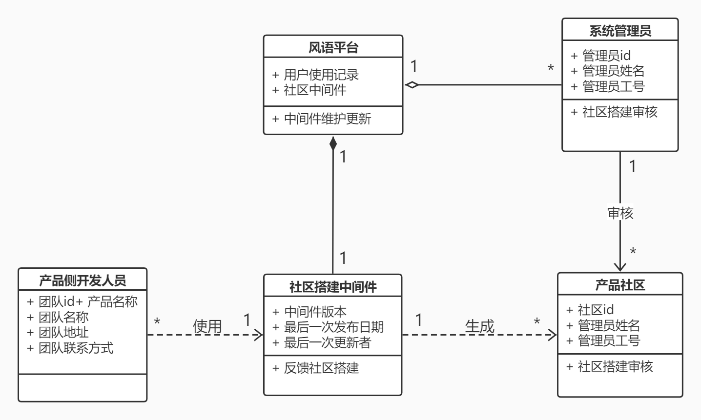
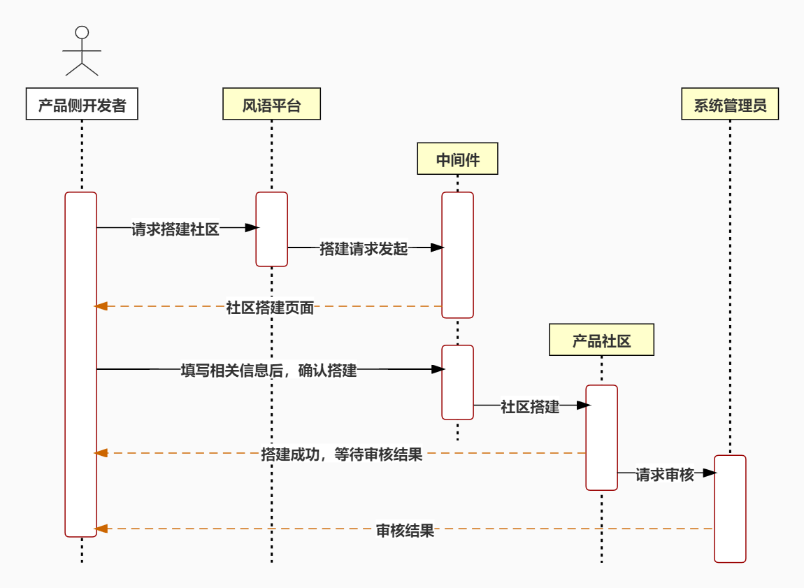
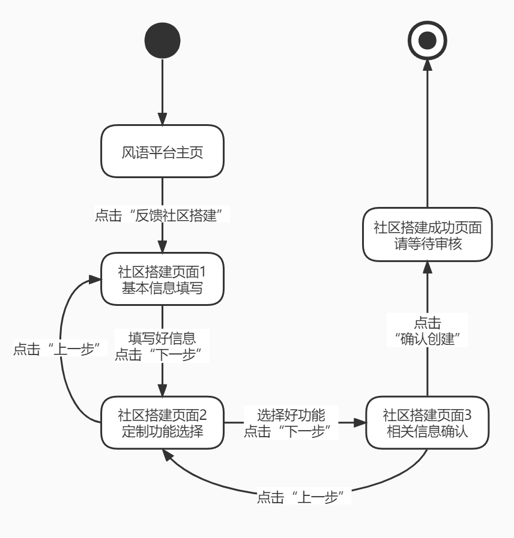

## 〇、待完成任务

- 选一个用例分析模型，画三个图：代表结构的类图（领域模型）、代表行为的顺序图和状态图 √
- 写自己负责目标模型的需求跟踪矩阵，包括用户需求及其对应的系统需求，填写跟踪矩阵 √
- 总体描述中的约束、假设和依赖 √
- 详细需求描述中的功能需求，写自己对应目标模型的用例对应功能的分析 √
- 详细需求描述中的约束 √
- 详细需求描述中的其他需求 √

## 一、完成内容

### 反馈社区搭建分析模型

#### 1）领域模型

下图描述了反馈社区搭建中的类关系。

该图由产品侧开发人员、风语平台、社区搭建中间件、产品社区和系统管理员组成。其中系统管理员与风语平台是聚合关系；社区搭建中间件和风语平台是组合关系，并且风语平台持续对中间件进行维护和更新，中间件主要负责为产品侧开发人员搭建反馈社区的任务；产品侧开发人员通过使用风语平台的社区搭建中间件进行反馈社区搭建；搭建生成的产品社区由系统管理员进行审核。

#### 2）顺序图

下图描述了反馈社区搭建中的实体交互顺序。

该顺序图展示了产品侧开发人员建立自己产品的用户反馈社区的过程。首先在风语平台上请求搭建反馈社区，风语平台向中间件发起搭建请求，然后系统为用户提供社区搭建页面；用户填写社区搭建相关的信息后提交至中间件；中间件搭建好产品社区，并提示用户搭建成功、等待审核结果；产品社区交系统管理员进行审核，审核结束后，将审核结果通知产品侧开发人员。

#### 3）状态图

下图描述了反馈社区搭建中的状态和流转情况。

该状态图中，主要包含平台主页、基本信息填写页、定制功能选择页、相关信息确认页、搭建成功通知页等状态。状态之间的转换是线性的，即用户在各个页面之间通过点击下一步或上一步来转换到下一状态或回退至上一状态；最终确认搭建社区相关信息后，系统展示搭建成功通知页面并到达结束状态。

### 2 总体描述

#### 2.4 约束

CON1：系统前端应基于Web前端开发技术，后端使用分布式、云计算等技术进行社区资源分配和社区间隔离

CON2：开发过程应使用螺旋模型

CON3：开发过程中要对风语SDK进行持续维护和更新

#### 2.5 假设与依赖

AS-1：承载社区资源的分布式服务器有较高的稳定性，以维持社区良好运行

AS-2：可以确保服务器的安全，防止社区数据被恶意篡改或删除

DE-1：系统的知识积累功能依赖于稳定高效的知识积累算法和用户的历史反馈

DE-2：系统的智能引导功能依赖于稳定高效的引导算法和用户的历史行为

### 3 详细需求描述

#### 3.2 功能需求

##### 3.2.2 反馈社区搭建

- 特征描述：反馈社区搭建是本系统的主要功能，也是本系统面向产品侧开发人员的主要功能，开发人员通过填写产品相关信息并定制社区功能来搭建产品专属的用户反馈社区

- 刺激/响应序列

  - 刺激：开发人员点击“搭建反馈社区”按钮
  - 响应：系统跳转到社区搭建页面
  - 刺激：开发人员填写基本信息后，点击“下一步”
  - 响应：系统跳转到定制选择页面
  - 刺激：开发人员选择开启“定期发送反馈报告”功能
  - 响应：系统显示详细的反馈报告定制功能框
  - 刺激：开发人员选择好定制功能后，点击“下一步”
  - 响应：系统跳转至信息确认页面
  - 刺激：开发人员确认信息无误并勾选同意协议后，点击“下一步”
  - 响应：系统提示社区创建成功，请等待审核

- 相关功能需求

  | 功能           | 描述                                         |
  | -------------- | -------------------------------------------- |
  | Create.skip    | 系统跳转至下一页面                           |
  | Create.save    | 系统保存反馈社区相关的信息                   |
  | Create.audit   | 系统将反馈社区信息发送至系统管理员处交其审核 |
  | Create.info    | 系统显示社区搭建相关信息供用户核对           |
  | Create.display | 系统显示定制化板块供用户进行定制化功能选择   |

#### 3.4 约束

IC1：系统需要保护社区信息，防止信息泄露

IC2：系统收集用户历史动作及相关反馈时需对相关数据进行脱敏，并仅将这些数据用于知识积累分析

IC3：系统需要对不同产品的不同社区之间作好资源分配和隔离，避免信息交叉

#### 3.6 其他需求

RE1：产品开发团队在使用平台前需进行相关认证

RE2：产品开发团队需为中国大陆地区团队

### 跟踪矩阵

#### 需求列表

UR2. 反馈社区定制化搭建

SR2. 

- 1）系统要提供搭建产品反馈社区的中间件
- 2）系统要根据产品团队需求提供定制化搭建功能
- 3）系统提供的中间件应该易用高效、持续完善
- 4）系统应该为产品团队提供定制化搭建指引

#### 跟踪矩阵

<table>
	<head>
		<tr>
			<th align="center" colspan="3" rowspan="2">原始信息</th>
            <th align="center" colspan="7">过程信息</th>
            <th align="center" colspan="3" rowspan="2">处理信息</th>
            <th align="center" colspan="3" rowspan="2">变更信息</th>
		</tr>
       	<tr>
			<th align="center" colspan="3">需求是否可实现</th>
            <th align="center" colspan="4">需求是否符合规划目标</th>
		</tr>
        <tr>
			<th align="center">需求编号</th>
            <th align="center">需求类别</th>
            <th align="center">需求来源</th>
            <th align="center">具有难度</th>
            <th align="center">可行性</th>
            <th align="center">风险</th>
            <th align="center">改善产品功能</th>
            <th align="center">改善产品性能</th>
            <th align="center">增加用户满意度</th>
            <th align="center">增加产品竞争力</th>
            <th align="center">是否实现</th>
            <th align="center">优先级</th>
            <th align="center">未实现原因</th>
            <th align="center">是否出现变更</th>
            <th align="center">变更基线</th>
            <th align="center">变更记录</th>
		</tr>
	</head>
    <body>
		<tr>
			<td>UR2</td>
			<td>用户需求</td>
			<td>客户</td>
			<td>是</td>
            <td>可行</td>
			<td>无</td>
			<td>是</td>
			<td>否</td>
            <td>是</td>
			<td>是</td>
			<td>实现</td>
			<td>最高</td>
            <td></td>
			<td>否</td>
			<td></td>
			<td></td>
		</tr>
        <tr>
			<td>SR2</td>
			<td>系统需求</td>
			<td>客户</td>
			<td>是</td>
            <td>可行</td>
			<td>无</td>
			<td>是</td>
			<td>是</td>
            <td>是</td>
			<td>是</td>
			<td>实现</td>
			<td>最高</td>
            <td></td>
			<td>否</td>
			<td></td>
			<td></td>
		</tr>
	</body>
</table>
