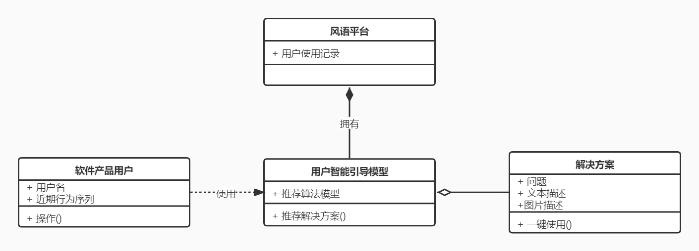
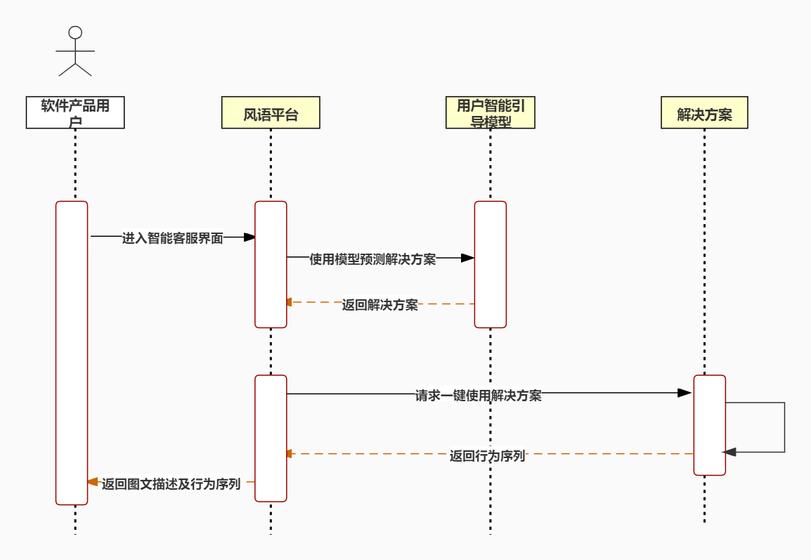
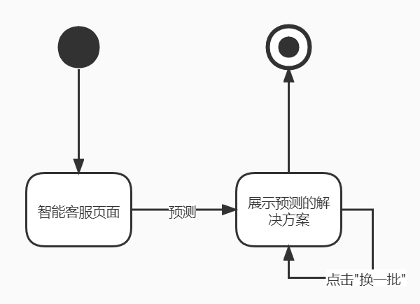

## TODO

- 选一个用例分析模型，三个图代表结构的类图（领域模型）与代表行为的顺序图与状态图
- 写自己负责目标模型的需求跟踪矩阵，包括用户需求及其对应的系统需求、填写跟踪矩阵
- 详细需求描述的对外接口需求
- 详细需求描述的功能需求，写自己对应目标模型的用例对应功能的分析即可
- 详细需求描述的质量属性

## 一、分析模型

### 4.使用智能客服

#### 4.1 领域模型

下图描述了使用智能客服中的类关系。

该图由软件产品用户、风语平台、用户智能引导模型和解决方案组成。其中风语平台和用户智能引导模型是聚合关系；用户智能引导模型和解决方案是组合关系，并且用户智能引导模型持续对解决方案进行维护和更新；软件产品用户和用户智能引导模型是依赖关系，在软件产品用户进入智能客服界面时，将使用用户智能引导模型，来获得推荐的解决方案。

#### 4.2 顺序图

下图描述了使用智能客服中的实体交互顺序。

该顺序图展示了软件产品用户使用智能客服的过程。首先在风语平台上进入智能客服界面，风语平台向用户智能引导模型发起预测请求，然后用户智能引导模型返回预测的解决方案。然后系统请求一键使用解决方案，解决方案返回其对应的行为序列。最后，风语平台将解决方案的图文描述及行为序列一同返回给软件产品用户并展示。

#### 4.3 状态图

下图描述了使用智能客服中的状态和流转情况。

该状态图中，主要包含智能客服页面和解决方案展示页面等状态。首先，在初始状态下，用户进入智能客服页面，风语平台会使用用户智能引导模型去进行预测，预测结束后会返回预测的解决方案；若用户点击“换一批“则展示另外一批解决方案。最后，用户退出展示界面后进入结束状态。

## 二、需求跟踪矩阵

### 1.需求列表

UR4. 使用智能客服

SR4. 

- 1）系统要提供软件产品用户智能引导算法
- 2）系统要根据软件产品用户的近期操作来预测用户需要的解决方案
- 3）系统提供的解决方案应该简洁、清晰
- 4）系统应该为软件产品用户提供一键使用功能

### 2.跟踪矩阵

<table>
	<head>
		<tr>
			<th align="center" colspan="3" rowspan="2">原始信息</th>
            <th align="center" colspan="7">过程信息</th>
            <th align="center" colspan="3" rowspan="2">处理信息</th>
            <th align="center" colspan="3" rowspan="2">变更信息</th>
		</tr>
       	<tr>
			<th align="center" colspan="3">需求是否可实现</th>
            <th align="center" colspan="4">需求是否符合规划目标</th>
		</tr>
        <tr>
			<th align="center">需求编号</th>
            <th align="center">需求类别</th>
            <th align="center">需求来源</th>
            <th align="center">具有难度</th>
            <th align="center">可行性</th>
            <th align="center">风险</th>
            <th align="center">改善产品功能</th>
            <th align="center">改善产品性能</th>
            <th align="center">增加用户满意度</th>
            <th align="center">增加产品竞争力</th>
            <th align="center">是否实现</th>
            <th align="center">优先级</th>
            <th align="center">未实现原因</th>
            <th align="center">是否出现变更</th>
            <th align="center">变更基线</th>
            <th align="center">变更记录</th>
		</tr>
	</head>
    <body>
		<tr>
			<td>UR4</td>
			<td>用户需求</td>
			<td>客户</td>
			<td>是</td>
            <td>可行</td>
			<td>无</td>
			<td>是</td>
			<td>否</td>
            <td>是</td>
			<td>是</td>
			<td>实现</td>
			<td>最高</td>
            <td></td>
			<td>否</td>
			<td></td>
			<td></td>
		</tr>
        <tr>
			<td>SR4</td>
			<td>系统需求</td>
			<td>客户</td>
			<td>是</td>
            <td>可行</td>
			<td>无</td>
			<td>是</td>
			<td>是</td>
            <td>是</td>
			<td>是</td>
			<td>实现</td>
			<td>最高</td>
            <td></td>
			<td>否</td>
			<td></td>
			<td></td>
		</tr>
	</body>
</table>

## 三、软件需求规格说明

### 3.详细需求描述

#### 3.1 对外接口需求

##### 3.1.1 用户界面

- UI：系统应该使用web界面，更好地与用户进行交互。界面图示为

更多界面可参考《风语平台需求获取文档》。

##### 3.1.2 硬件接口

- HI：系统应该运行在Linux操作系统上。

##### 3.1.3 软件接口

- SI：系统应该提供一个完整的SDK，支持开发者直接将SDK部署到项目中。

##### 3.1.4 通信接口

- CI：客户端与服务器使用ajax进行通信。

#### 3.2 功能需求

##### 3.2.1 使用智能客服

###### 3.2.1.1 特性描述

使用智能客服是帮助用户侧与产品侧的交流反馈的主要功能之一，系统可以根据用户最近的行为来预测用户可能需要的解决方案，展示解决方案的图文描述，并提供一键使用功能。

###### 3.2.1.2 刺激/相应序列

- 刺激： 用户点击联系客服的页面
- 响应：系统通过用户最近的行为，自动推荐解决方案，展示图文描述
- 刺激：用户点击”换一批“
- 响应：系统展示下一批解决方案
- 刺激：用户判断解决方案有无帮助
- 响应：系统记录该解决方案的预测结果
- 刺激：用户点击”一键使用“
- 响应：系统按照该解决方案的操作流程自动响应

###### 3.2.1.3 相关功能需求

| 功能             | 描述                         |
| ---------------- | ---------------------------- |
| Solution.predict | 系统自动预测解决方案         |
| Solution.next    | 系统展示下一批解决方案       |
| Solution.save    | 系统保存该方案的预测结果     |
| Solution.show    | 系统显示解决方案的图文描述   |
| Solution.use     | 系统执行该解决方案的行为序列 |

#### 3.5 质量属性

- Quality1：系统运行时应该保证其正确性，不出现与预期不符合的结果。
- Quality2：系统应该保证其完整性，不能遗漏任何必要的功能。
- Quality3：系统的功能应该与需求规格说明对各种需求的描述一致。
- Quality4：系统运行时应该保证其稳定性，运行期间不出现崩溃。
- Quality5：系统应该具有可修改性，可以在较短时间内添加新功能。